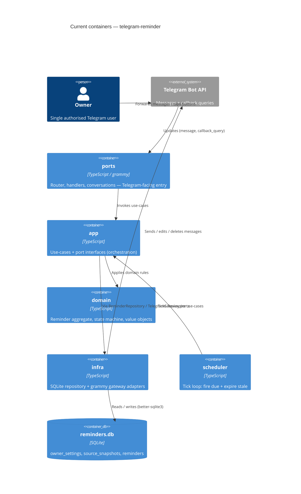

# Architecture map — telegram-reminder

> The **current** architecture (what exists today), produced by `survey` and read by
> specify / design / data-model / implement. Refresh with `survey` when the repo drifts past
> `reflects_commit`. This is generated; a hand-maintained `docs/architecture.md`, if present, is
> authoritative and reconciled below — not replaced.

## Stack

- Language / runtime: TypeScript 5.4 (ES2022, NodeNext), Node.js `>=22` (`package.json:6`, `tsconfig.json`)
- Frameworks: `grammy` 1.21 + `@grammyjs/conversations` 1.2 (Telegram), `better-sqlite3` 9.4 (synchronous SQLite) (`package.json:18-22`)
- Build / test / lint: `npm run build` → `tsc`; `npm test` → `vitest run`; migrations `npm run migrate:up|down`; **no lint/vet configured** (`package.json:9-16`)

## C4 — system as it is

## Module inventory

| Module | Path | Layers | Wired at | Responsibility |
|---|---|---|---|---|
| domain | `src/domain/` | domain | n/a (pure) | Reminder aggregate, state machine, value objects, domain errors |
| app | `src/app/` | app + ports | `src/main.ts:50-53` | Use-cases (capture/schedule/fire/snooze/resolve/expire) + port interfaces |
| infra | `src/infra/` | infra | `src/main.ts:27-47` | `SqliteReminderRepository`, `GrammyTelegramGateway`, DB open/migrate |
| ports | `src/ports/` | ports (adapter-in) | `src/main.ts:53-61` | Router, callback handlers, capture conversation, tz utils |
| scheduler | `src/scheduler/` | infra (driver) | `src/main.ts:52,67` | Interval tick → `FireDueReminders` + `ExpireStalePrompts` |

## Conventions (cited — the rules a new feature must match)

- **Module wiring / registration:** manual constructor DI in the composition root — `src/main.ts:27-53`
- **Error handling:** domain custom error classes extending `Error` with overridden `.name` — `src/domain/errors.ts:1-35`; adapters catch domain errors at the handler boundary — `src/ports/conversations/capture-conversation.ts:92-114`
- **IDs:** SQLite `INTEGER PRIMARY KEY AUTOINCREMENT`; domain uses optional `id?: number` (unset pre-persist) — `migrations/03_create_reminders.up.sql:10`, `src/domain/reminder.ts:5-15`
- **Persistence / DB access:** `app/ports` interface implemented in `infra/db`; synchronous `better-sqlite3`, atomic save via transaction — `src/infra/db/sqlite-reminder-repository.ts`
- **Migrations:** Flyway-style `NN_description.{up,down}.sql` in `migrations/`, tracked in `_migrations`, applied in sorted order — `src/infra/db/migrate.ts:24-42`
- **Tests:** Vitest (`globals: false`), co-located `__tests__/*.test.ts`; integration uses tmpdir DB + `beforeAll`/`afterAll` — `vitest.config.ts`, `src/infra/__tests__/sqlite-reminder-repository.test.ts:1-31`
- **Inter-module communication:** direct in-process calls along the hexagonal direction (ports/scheduler → app → domain; app → infra via port interfaces) — `src/app/use-cases/fire-due-reminders.ts:11-32`
- **UI / styling:** N/A — Telegram inline keyboards only (see §Frontend / UI foundation)

## Datastores

| Store | Engine | Accessed via | Notes |
|---|---|---|---|
| `./data/reminders.db` | SQLite (`better-sqlite3`) | `SqliteReminderRepository` (`app/ports/reminder-repository.ts` contract) | 3 tables: `owner_settings` (single row id=1), `source_snapshots`, `reminders`; key index `idx_reminders_state_scheduled_at` |

## Frontend / UI foundation

<!-- N/A: no web frontend — Telegram bot UI only -->

The only UI surface is Telegram inline keyboards + message text (Ukrainian), rendered in adapters:

- **Quick-pick on capture:** `[1h | evening | tomorrow | week | custom]` — `src/ports/conversations/capture-conversation.ts:23-68`
- **Fired-reminder buttons:** `[⏰ Snooze | ✅ Done]` / `[🗑 Delete | 🔗 Source]` — `src/infra/telegram/grammy-telegram-gateway.ts:35-44`
- **Transient multi-turn state:** `pendingCustom` map for custom-time input — `src/ports/router.ts:15-16`

A new "UI" change = new inline keyboard / handler in `src/ports/`, not a web component.

## Where things live / closest precedents

- A new **use-case** → `src/app/use-cases/<name>.ts` (input interface + constructor DI + `execute`), modelled on `FireDueReminders` (`src/app/use-cases/fire-due-reminders.ts:11-32`) or `ScheduleReminder` (`src/app/use-cases/schedule-reminder.ts:12-20`).
- A new **domain rule / state** → extend `Reminder` + `valid_transitions` in `src/domain/state-machine.ts`, with a domain error in `src/domain/errors.ts`.
- A new **Telegram interaction** (button/command) → handler in `src/ports/handlers/` wired through `buildRouter`, modelled on `resolve-handler.ts` (`src/ports/handlers/resolve-handler.ts:9-40`).
- A new **persisted field/table** → paired `migrations/NN_*.{up,down}.sql` + mapper update in `src/infra/db/row-mappers.ts` + repository method.

## Constraints & known tech-debt

- **Single-owner bot:** auth gates on `OWNER_TELEGRAM_ID`; `owner_settings` is a single row (id=1). Multi-user is out of scope without a schema change — `src/main.ts:10-11,31-34`.
- **No lint/static-analysis configured** — the per-task gate in `implement` will run unit (+ integration) only; `gate_lint`/`gate_vet` skip gracefully.
- **Telegram 48h delete window:** message deletion can fail with `TelegramDeleteWindowError` and is handled by falling back to a placeholder edit — `src/app/ports/telegram-gateway.ts:23-28`.
- **Re-fire semantics (ADR-0005):** a send failure leaves the reminder in `firing` for retry rather than rolling back — `src/app/use-cases/fire-due-reminders.ts:24-30`.

## Reconciliation with the authored architecture doc

No authored `docs/architecture.md` / `ARCHITECTURE.md` / root `CLAUDE.md` exists; this map is the current reference. The `telegram-reminder` feature's own artifacts under `docs/features/telegram-reminder/` (spec, SAD, ADRs) remain the per-feature source of truth.
