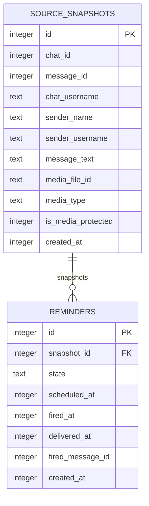

# Data model — keep-fired-reminders-visible

> **Thin reconciliation pass.** Per `sad.md` §4: "No schema change and no new migration are implied by this feature (ADR-0002)." This document reconciles the existing `reminders` / `source_snapshots` schema against the widened query scope and the new capture-order ADR — it does not introduce any table, column, or migration.

## ER diagram

Unchanged from `telegram-reminder` / `list-active-reminders` — reused as-is.

## Entities

### `reminders` (aggregate root) — unchanged

No column added, removed, or retyped. `state` keeps its existing 7-value `CHECK` (`awaiting_time`, `pending`, `firing`, `fired`, `done`, `deleted`, `expired`) — `done` stays a *valid*, now dormant transition per ADR-0001; no new state value is introduced.

| Column | Type | Constraints | Notes |
|---|---|---|---|
| `id` | INTEGER | PK, AUTOINCREMENT | monotonic — this feature repurposes it as the capture-order sort/truncation key (ADR-0002), no schema change needed since it already satisfies "assigned once at capture, never recomputed" |
| `snapshot_id` | INTEGER | NOT NULL, FK → `source_snapshots(id)` | unchanged |
| `state` | TEXT | NOT NULL, CHECK (7 values) | unchanged; the widened list query now reads `IN ('pending','firing','fired')` instead of `= 'pending'` — a query-scope change, not a schema change |
| `scheduled_at` | INTEGER | nullable | unchanged; no longer the list's sort key (superseded by `id`, ADR-0002) but still used for the scheduler-tick query and rendered per row |
| `fired_at` | INTEGER | nullable | unchanged |
| `delivered_at` | INTEGER | nullable | unchanged |
| `fired_message_id` | INTEGER | nullable | unchanged |
| `created_at` | INTEGER | NOT NULL | unchanged |

**Aggregate root:** `reminders` (root of the `reminders` ↔ `source_snapshots` relationship, `source_snapshots` is the dependent/immutable-capture side).
**Access patterns:** widened list read → `WHERE state IN ('pending','firing','fired') ORDER BY id ASC` (see Indexes below for why no new index is added).
**Constraints:** unchanged — `state` `CHECK`, FK → `source_snapshots(id)` (already indexed by `idx_reminders_snapshot_id`).

### `source_snapshots` — unchanged

No column touched by this feature. Reused as-is by the widened list read (unchanged join).

## Drift check

Compared the domain `Reminder` type (`src/domain/reminder.ts`) and `state-machine.ts` states against the `reminders` table: `id`, `snapshot`(→`snapshot_id`), `state`, `scheduledAt`, `firedAt`, `deliveredAt`, `firedMessageId`, `createdAt` all map 1:1 to existing columns with matching nullability. **No drift found** — no `field-without-column`, `column-without-field`, `type-mismatch`, or `nullability-mismatch`. No `_drift/` fix migrations generated.

## Indexes

| Index | Columns | Query it serves |
|---|---|---|
| `idx_reminders_state_scheduled_at` (existing) | `(state, scheduled_at)` | scheduler-tick query (`state = 'pending' AND scheduled_at <= ?`) and the *previous* `findActivePendingOrdered` sort — reused as-is, not touched by this feature |
| `idx_reminders_snapshot_id` (existing) | `(snapshot_id)` | FK-backing index, unchanged |

**Considered and rejected: a new index for the widened list query.**

- **Candidate:** `idx_reminders_state (state)` or a composite touching `id`, to back `WHERE state IN ('pending','firing','fired') ORDER BY id ASC`.
- **Rejected because:** `id` is the table's `INTEGER PRIMARY KEY` (SQLite rowid alias), so rows are already physically ordered by `id` — `ORDER BY id ASC` needs no index to avoid a sort. The remaining cost is a full-table scan to filter `state IN (...)`, which is acceptable at this bot's scale (single Owner, personal use, dataset size is at most a few hundred rows) and within the existing p95 ≤ 1000 ms NFR (spec §6, unchanged from `list-active-reminders`) with no profiling evidence of a bottleneck.
- **Revisit if:** row count grows enough that a full scan measurably threatens the latency NFR — not expected under the single-Owner constraint (`sad.md` §2).

## Test fixtures

No new fixture factories are required beyond what `list-active-reminders` already provides — reused as-is:

- existing `reminders` row builder (seeds across `pending` / `firing` / `fired` / `deleted` states per `spec.md`'s integration strategy) — extend its call sites in the new tests to seed `fired` rows explicitly; no new builder function.
- existing `source_snapshots` fixture — unchanged, joined as before.

## Migrations

**None staged.** No entity, column, or index changes are introduced by this feature (ADR-0002 confirms `id` already serves as the capture-order key; the index reconciliation above concluded no new index is warranted). `docs/features/keep-fired-reminders-visible/migrations/` is intentionally empty — there is nothing for `implement` to promote for the `layer: migration` task; the schema-touching work for this feature is limited to query-scope and view-model code, not DDL.
