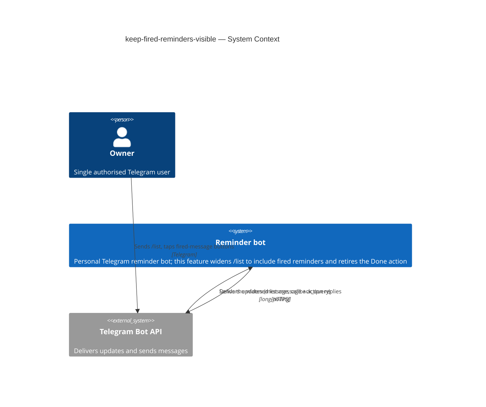
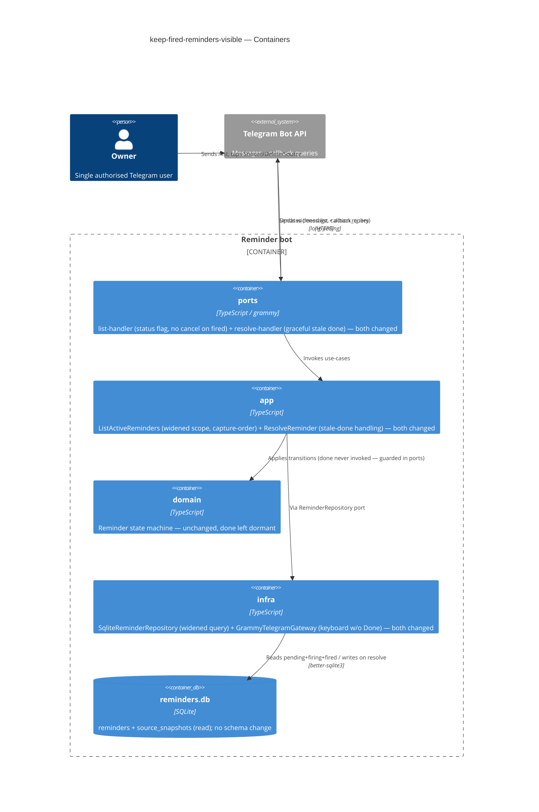
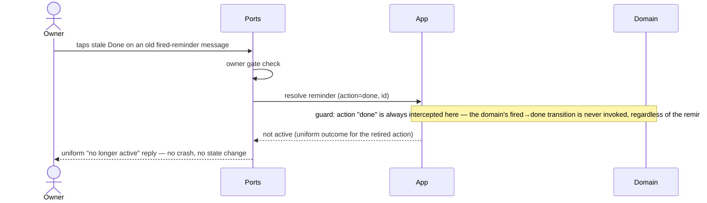
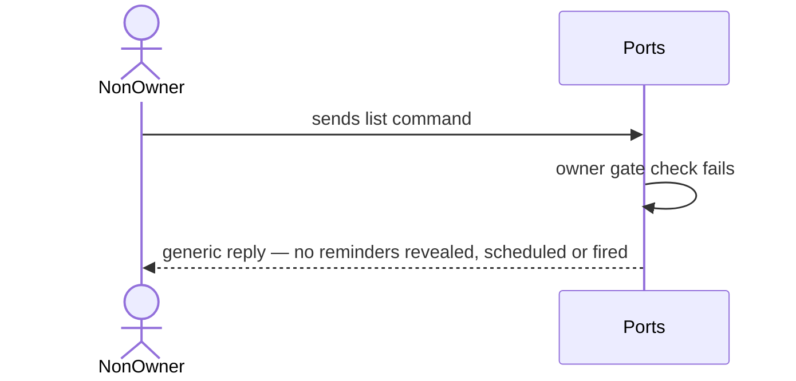
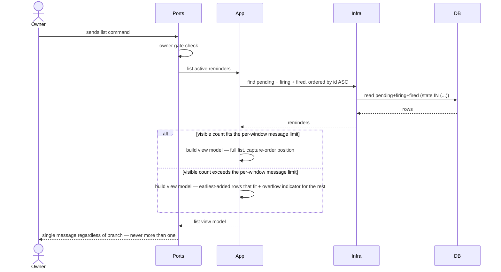
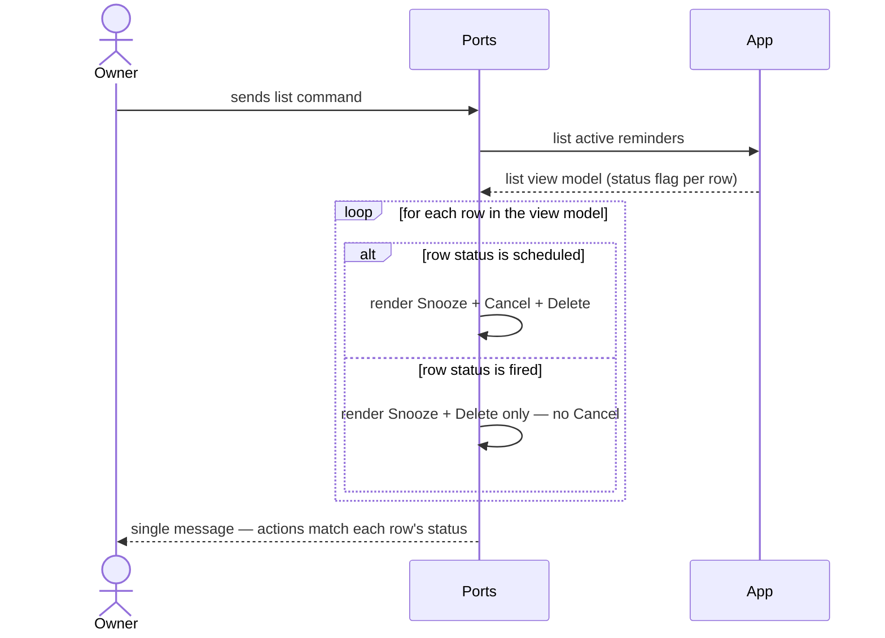

# Software Architecture Document — keep-fired-reminders-visible

<!-- 12 Arc42 sections. Empty section → <!-- N/A: <one-line reason> -->. -->
<!-- C4 Context (L1) lives inline in §3. C4 Container (L2) lives inline in §5. -->
<!-- Numbers in §10 come VERBATIM from spec.md §6 NFR — no inventing, no rounding. -->

## 1. Introduction and goals

**Intent.** The Owner of the reminders bot must be able to trust the list as a complete, accurate picture of everything still unresolved — both scheduled and already-fired reminders — clearly distinguishing the two, holding each entry at a stable position, and offering exactly one way to remove an entry: Delete.

**Top-3 quality goals (1-liners; full scenarios in §10):**

1. **Accuracy** — the list reflects every reminder not yet explicitly deleted (scheduled or fired), ordered by capture time
2. **Owner-only** — no `/list` command response leaks any reminder data to a non-Owner
3. **Latency** — p95 list response ≤ 1000 ms from command receipt to message sent (unchanged from `list-active-reminders`)

**Stakeholders.**

| Role | Interest | Sign-off owner? |
|---|---|---|
| Owner | Uses `/list`, relies on it as the complete picture of everything still outstanding | No |
| Tech Lead | SAD approval | Yes |
| Security Lead | Reviews the absence of a new authorization boundary (spec §6.1) | No |

<!-- Decision overrides (¶4) — populated by the critic resolution loop, empty otherwise. -->

## 2. Constraints

**Technical.**
- TypeScript 5.4 (ES2022, NodeNext), Node.js `>=22`.
- `grammy` 1.21 + `@grammyjs/conversations` 1.2 (Telegram); `better-sqlite3` 9.4 (synchronous SQLite), store `./data/reminders.db`.
- Hexagonal ports-and-adapters layering — inherited from `telegram-reminder` ADR-0006 (`domain` ← `app`/`ports` ← `infra`).
- Telegram Bot API limits: `callback_data` ≤ 64 bytes, message text ≤ 4096 chars, 48h message-delete window.

**Organisational.**
- Effort budget: size S (a small handful of PRs).
- No hard external deadline.
- Solo maintainer (Mykhailo Podaniev).

**Conventions.**
- `docs/architecture-map.md` is the cited convention reference (no separate convention file exists).
- Manual constructor DI in the composition root `src/main.ts`; domain custom error classes (`src/domain/errors.ts`); Vitest co-located `__tests__/*.test.ts`; Flyway-style `NN_*.{up,down}.sql` migrations.

**Regulatory / external.**
- Single-Owner bot; data is confidential (the Owner's forwarded personal messages). No new PII or fields are introduced (spec §6.1).
- No new authorization boundary — this feature widens what the already owner-gated `/list` view shows; it does not add a capability. Removing Done *narrows* the fired-reminder message's capabilities.

**Inherited decision overrides (spec §1 ¶4 — documented here as given constraints, not re-litigated):**
- the list now includes `fired`-but-undeleted reminders (reopens the `list-active-reminders` pending-only scope)
- list order is capture-time based, not fire-time based
- truncation keeps "earliest-added that fit", not "soonest-firing that fit"
- the Done action is retired entirely; Delete is the sole resolving action

## 3. Context and scope

The Reminder bot is a single-Owner Telegram bot that captures messages and fires them at a scheduled time. This feature widens the existing `/list` read view (it already shows the `pending` set) to also include `fired`-but-undeleted reminders, and retires the `Done` action from the fired-reminder message. It adds no new actor, no new external system, and no new trust boundary: every `/list` command and every list/fired-message button is processed only for the configured Owner; all other Telegram users are rejected and see nothing.

<!-- brownfield: extends telegram-reminder + list-active-reminders (hexagonal TS bot, grammy + better-sqlite3); reuses the existing reminders/source_snapshots tables, the owner gate, tz utils, the deep-link/inline-fallback rule, and the existing list-handler/resolve-handler code paths. No new external dependency. -->

**External systems (in / out):**

| Actor or system | Type | Interaction |
|---|---|---|
| Owner | Person | Sends `/list`; taps Snooze/Delete/Source on a fired-reminder message (Done removed) |
| Telegram Bot API | System (external) | Delivers updates (`message`, `callback_query`) via long-polling; receives the bot's outgoing messages |

**C4 Context (L1):**



## 4. Solution strategy

**Target surface:** `backend-service` — the existing single bot process. This feature adds no new deployable unit and no UI surface in the C4 sense. Surface selection is inherited from `telegram-reminder` / `list-active-reminders`, so it does not cross the blast-radius gate; recorded in frontmatter `target_surfaces`.

**Top strategic choices (the seeds for ADRs):**

1. **Widen the list query scope** — one repository query, `state IN ('pending', 'firing', 'fired')` instead of `state = 'pending'`; the view model gains a per-row status field (`scheduled` / `fired`). Single vertical slice (infra + app), reversible, no legitimate competing approach worth an ADR — folded into §5.
2. **Retire the Done action, with a graceful stale-callback path** — removes the `✅ Done` button from the fired-reminder keyboard; the resolve handler intercepts any `done` action **before** invoking the domain transition (a handler-level guard, not a catch on the domain's response) and always replies with the existing uniform "no longer active" message. This is necessary because `fired → done` is a *valid* domain transition (`state-machine.ts`) — a still-`fired`-and-undeleted reminder would otherwise resolve successfully instead of being rejected, violating AC-06. Touches `infra` (gateway keyboard) and `ports` (resolve handler guard); leaves a dormant, now fully unreachable `domain` state/transition. → **ADR-0001**.
3. **Use the monotonic reminder `id` as the sole ordering + truncation key** — capture-order position, superseding the fire-time ordering `list-active-reminders` used; no schema change since `id` already satisfies "assigned once at capture, never recomputed." → **ADR-0002**.

No schema change and no new migration are implied by this feature (ADR-0002); `data-model` is expected to be a thin reconciliation pass, not new tables/columns.

## 5. Building block view

Hexagonal (ports-and-adapters), unchanged layering. The feature is a thin vertical slice touching two `app` use-cases, two `ports` handlers, and two `infra` adapters — no new container, no schema change, `domain` unchanged (the `done` transition stays defined but unreachable per ADR-0001).

**Internal decomposition (new / touched):**

```
src/
├── domain/
│   └── state-machine.ts                 unchanged — `done` transition stays defined but unreachable (ADR-0001)
├── app/
│   ├── use-cases/
│   │   ├── list-active-reminders.ts     CHANGED — query scope pending+firing+fired; row gains status field; truncation key → capture-order (ADR-0002)
│   │   └── resolve-reminder.ts          CHANGED — guards `action === "done"` before calling the domain transition (never invokes `resolve_done`) → uniform not-active outcome, regardless of the reminder's actual state (ADR-0001)
│   └── ports/
│       └── reminder-repository.ts       + method signature covers pending+firing+fired scope, ordered by id ASC
├── infra/
│   ├── db/sqlite-reminder-repository.ts CHANGED — `state IN ('pending','firing','fired')`, `ORDER BY id ASC` (ADR-0002)
│   └── telegram/grammy-telegram-gateway.ts  CHANGED — fired-reminder keyboard drops `✅ Done` (ADR-0001)
└── ports/
    ├── handlers/list-handler.ts         CHANGED — renders scheduled/fired flag per row; suppresses cancel button on fired rows (AC-05, already pending-only today)
    └── handlers/resolve-handler.ts      CHANGED — maps stale `done` callback to the existing uniform "no longer active" reply (ADR-0001)
```

**C4 Container (L2):**



## 6. Runtime view

**Critical flow 1: render the widened list**

```mermaid
sequenceDiagram
    actor Owner
    participant Ports
    participant App
    participant Infra
    participant DB
    Owner->>Ports: sends list command
    Ports->>Ports: owner gate check
    Ports->>App: list active reminders
    App->>Infra: find pending + firing + fired, ordered by id ASC
    Infra->>DB: read pending+firing+fired (state IN (...))
    DB-->>Infra: rows
    Infra-->>App: reminders
    App->>App: build view model (status flag per row; truncate by capture order + overflow)
    App-->>Ports: list view model
    Ports-->>Owner: single message — scheduled/fired flag per row, stable capture-order position
```

**Critical flow 2: stale Done tap on an old fired-reminder message (AC-06)**



The guard sits in `app`, ahead of any call into `Domain` — this is deliberate: `fired → done` is a *valid* transition in the state machine, so a still-`fired`-and-undeleted reminder would otherwise resolve successfully instead of being rejected, which would violate AC-06.

**Critical flow 3: non-Owner requests the list (AC-07)**



The gate rejects before any call into `App`/`Infra`/`DB` — a non-Owner never causes a read of reminder data, so there is nothing to leak even at the message-content level.

**Critical flow 4: list response respects the per-window overflow limit (AC-08)**



Both branches still produce exactly one bot message — the overflow branch trades completeness for the single-message NFR, never spilling into a second send.

**Critical flow 5: fired reminder keeps its position and stays visible until explicit delete (AC-03, AC-04)**

```mermaid
sequenceDiagram
    actor Owner
    participant Ports
    participant App
    participant Infra
    participant DB
    Note over App,DB: reminder already visible in the list at some capture-order position
    alt reminder fires (scheduler-driven)
        App->>Infra: transition pending → firing → fired (both persisted; visible throughout, incl. a stuck/retrying firing window, ADR-0005)
        Infra->>DB: persist each state change (id unchanged)
    else Owner snoozes to a new time
        Owner->>Ports: taps Snooze
        Ports->>App: snooze reminder
        App->>Infra: update fire_at, state resets per existing rule
        Infra->>DB: persist fire_at + state change (id unchanged)
    else Owner explicitly deletes
        Owner->>Ports: taps Delete
        Ports->>App: delete reminder
        App->>Infra: remove reminder
        Infra->>DB: delete row
    end
    Owner->>Ports: sends list command
    Ports->>App: list active reminders
    App->>Infra: find pending + firing + fired, ordered by id ASC
    Infra->>DB: read pending+firing+fired (state IN (...))
    DB-->>Infra: rows
    Infra-->>App: reminders
    Note over App: position key is capture-order (id) — unaffected by fire/snooze; the deleted reminder is simply absent, everything else keeps its slot
    App-->>Ports: list view model
    Ports-->>Owner: single message — deleted entry gone, all others at their original position
```

Position is keyed on `id` (capture order), never on state or `fire_at` — so fire and snooze are no-ops for ordering, and only the delete branch removes a row from the next query's result set.

**Critical flow 6: fired entry offers no cancel action (AC-05)**



Cancel is a scheduling-only action — a fired reminder has nothing left to cancel, so the renderer omits the button per row rather than offering an action that would no-op or confuse.

**Coverage check.**

User stories → flows: US-01 → flows 1, 3, 4; US-02 → flow 1; US-03 → flow 5; US-04 → flows 5, 2; US-05 → flows 2, 6.

Acceptance criteria → flows:

| AC | Covered by |
|---|---|
| AC-01 | Flow 1 (happy path) |
| AC-02 | Flow 1 (status flag per row) |
| AC-03 | Flow 5 (position unaffected by fire/snooze) |
| AC-04 | Flow 5 (only delete removes a row) |
| AC-05 | Flow 6 (Cancel omitted on fired rows) |
| AC-06 | Flow 2 (stale Done guarded) |
| AC-07 | Flow 3 (non-Owner gate rejection) |
| AC-08 | Flow 4 (overflow truncation branch) |

Every §4 user story maps to ≥1 flow and every §5 AC maps to a flow or branch — no silent gaps.

## 7. Deployment view

<!-- N/A: reuses the existing single bot process / deployment unit — no new container, replica, or infra change. -->

No deployment change: the feature adds code to the existing bot process and reads/writes the existing `reminders.db`. Monitoring reuses the established structured timing log (for the p95 leaf in §10) and the global `bot.catch` handler (the KPI target of 0 unhandled stale-Done-tap errors over any 30-day window, spec §7).

## 8. Crosscutting concepts

| Concept | Convention | Where defined |
|---|---|---|
| Authorization | Owner gate on `/list` and every fired-message callback (`OWNER_TELEGRAM_ID`) — reuse, no new boundary | `src/main.ts` auth gate (map §Constraints) |
| Error handling | Stale-transition errors (`InvalidStateTransitionError` / `ReminderNotFoundError`) map to one uniform "no longer active" reply — extended from cancel (list-active-reminders) to the resolve path; the `done` action specifically is intercepted by a handler-level guard *before* any domain call (never a caught error), since `fired → done` is itself a valid transition (ADR-0001) | `src/domain/errors.ts` pattern; `list-handler.ts:114-126` |
| Ordering / position | Capture-order via monotonic `id ASC`, fixed at insert, never recomputed — supersedes fire-time ordering | ADR-0002 |
| Callback encoding | Action tag + `reminder_id` in `callback_data` (≤ 64 bytes) — reuse; `done` tag no longer emitted but still accepted defensively for legacy messages | `grammy-telegram-gateway.ts` |
| Status rendering | Each list row carries an explicit scheduled/fired flag, no extra timestamp beyond the existing bounded preview (spec §8 default) | `list-handler.ts` view rendering |
| Source link availability | Deep link if public username, else inline captured content — reuse, unchanged | existing fired-reminder source flow |
| Timezone rendering | Fire time in Owner's home timezone — reuse tz utils, unchanged | `ports` tz utils |
| Bounded output / anti-flood | Exactly 1 message per `/list`; truncation now keyed to capture order, still `min(max-count, 4096 chars)`; contributes ≤ 1 to the 10-msgs/60s budget | list-active-reminders ADR-0003 (truncation mechanism), ADR-0002 (key) |
| Internationalisation | Ukrainian message text, single language | existing convention |
| Observability | Structured timing log around the list use-case (p95 leaf); `bot.catch` for unhandled errors, including stale Done taps | existing |

## 9. Architecture decisions

| # | Title | Status | Section |
|---|---|---|---|
| 0001 | Retire the Done action with graceful stale-callback handling | Accepted | §4 |
| 0002 | Use the monotonic reminder id as the sole list ordering and truncation key | Accepted | §4 |

ADR files live under `docs/features/keep-fired-reminders-visible/adr/NNNN-<title>.md`.

## 10. Quality requirements

**QG-1. Accuracy**
- **When:** the list is requested under a fixed clock.
- **Then:** the list reflects every reminder not yet explicitly deleted (scheduled or fired) at query time, ordered by capture time ascending.
- **How verify:** integration test with a fixed clock (spec §6 — Accuracy row).

**QG-2. Owner-only**
- **When:** a Telegram user who is not the Owner sends the list command.
- **Then:** every list command is rejected for any non-Owner (scheduled or fired reminders alike).
- **How verify:** unit test on the auth gate (spec §6 — Owner-only row).

**QG-3. Latency**
- **When:** the Owner sends the list command.
- **Then:** p95 ≤ 1000 ms from command receipt to message sent.
- **How verify:** timing log around the list use-case (spec §6 — Latency p95 row; unchanged from `list-active-reminders`).

**QG-4. Bounded output / anti-flood**
- **When:** the Owner's visible set (scheduled + fired-undeleted) exceeds the per-window message limit.
- **Then:** exactly 1 bot message regardless of reminder count; the list still contributes at most 1 to the existing ≤ 10 bot messages / 60 s window.
- **How verify:** integration test asserting send-count = 1 (spec §6 — Messages-per-response + Anti-flood rows).

## 11. Risks and technical debt

| Risk / debt | Severity | Mitigation | Owner |
|---|---|---|---|
| Old fired-reminder messages (sent before rollout) keep a live `done:<id>` callback button indefinitely — Telegram gives no way to retroactively edit keyboards past the 48h window | Low | AC-06 uniform "no longer active" reply on any `done` tap, via a handler-level guard that never invokes the domain's (valid) `fired → done` transition — no crash, no state change regardless of the reminder's actual state | Mykhailo Podaniev |
| Fired-but-undeleted reminders accumulate with no cap beyond the existing truncation (spec §3 Non-goal: no archiving) | Low | Existing overflow indicator surfaces the hidden count; archiving is a deliberate Non-goal, revisit only if it becomes a real complaint | Mykhailo Podaniev |
| List position tied to the DB's autoincrement `id` (ADR-0002) rather than a domain-owned field | Low | Acceptable while the bot never bulk-imports or renumbers ids; would need a real `position` column only if that insert pattern changes | Mykhailo Podaniev |
| Dormant `done` domain state/transition (ADR-0001) is dead code that a future change could accidentally re-wire to a live callback | Low | AC-06 test coverage pins the graceful-rejection behavior; any future re-wiring would need to deliberately break that test | Mykhailo Podaniev |

**Accepted debt (acceptable in v1, plan to fix later):**
- No archiving/capping of fired-undeleted reminders beyond existing truncation (spec §3 Non-goal).
- The domain `done` state and `fired → done` transition remain in the codebase, permanently unreachable from any UI path (spec §8 default — not removed).

## 12. Glossary

| Term | Meaning |
|---|---|
| Visible reminder | A Reminder in `pending`, `firing`, or `fired` state that has not yet been explicitly deleted — the set the widened list shows (canonical: [CONTEXT.md](./CONTEXT.md)). |
| Capture order | List/truncation ordering key = the reminder's monotonic `id`, assigned once at capture and never recomputed (ADR-0002); supersedes fire-time ordering. |
| Stale Done tap | A tap on the `✅ Done` callback from a fired-reminder message sent before this feature's rollout — intercepted by a handler-level guard and handled as a graceful no-op, never a crash or silent resolution (ADR-0001, AC-06). |
| Dormant `done` state | The domain's `fired → done` transition — still a *valid* transition in `state-machine.ts`, but made unreachable from any UI path by the `ports`-level guard on the `done` action, not by any domain-level restriction (ADR-0001). |
