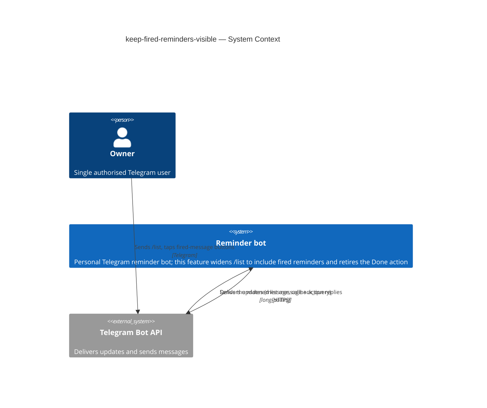

# Software Architecture Document — keep-fired-reminders-visible

<!-- 12 Arc42 sections. Empty section → <!-- N/A: <one-line reason> -->. -->
<!-- C4 Context (L1) lives inline in §3. C4 Container (L2) lives inline in §5. -->
<!-- Numbers in §10 come VERBATIM from spec.md §6 NFR — no inventing, no rounding. -->

## 1. Introduction and goals

**Intent.** The Owner of the reminders bot must be able to trust the list as a complete, accurate picture of everything still unresolved — both scheduled and already-fired reminders — clearly distinguishing the two, holding each entry at a stable position, and offering exactly one way to remove an entry: Delete.

**Top-3 quality goals (1-liners; full scenarios in §10):**

1. **Accuracy** — the list reflects every reminder not yet explicitly deleted (scheduled or fired), ordered by capture time
2. **Owner-only** — no `/list` command response leaks any reminder data to a non-Owner
3. **Latency** — p95 list response ≤ 1000 ms from command receipt to message sent (unchanged from `list-active-reminders`)

**Stakeholders.**

| Role | Interest | Sign-off owner? |
|---|---|---|
| Owner | Uses `/list`, relies on it as the complete picture of everything still outstanding | No |
| Tech Lead | SAD approval | Yes |
| Security Lead | Reviews the absence of a new authorization boundary (spec §6.1) | No |

<!-- Decision overrides (¶4) — populated by the critic resolution loop, empty otherwise. -->

## 2. Constraints

**Technical.**
- TypeScript 5.4 (ES2022, NodeNext), Node.js `>=22`.
- `grammy` 1.21 + `@grammyjs/conversations` 1.2 (Telegram); `better-sqlite3` 9.4 (synchronous SQLite), store `reminders.db`.
- Hexagonal ports-and-adapters layering — inherited from `telegram-reminder` ADR-0006 (`domain` ← `app`/`ports` ← `infra`).
- Telegram Bot API limits: `callback_data` ≤ 64 bytes, message text ≤ 4096 chars, 48h message-delete window.

**Organisational.**
- Effort budget: size S (a small handful of PRs).
- No hard external deadline.
- Solo maintainer (Mykhailo Podaniev).

**Conventions.**
- `docs/architecture-map.md` is the cited convention reference (no separate convention file exists).
- Manual constructor DI in the composition root `src/main.ts`; domain custom error classes (`src/domain/errors.ts`); Vitest co-located `__tests__/*.test.ts`; Flyway-style `NN_*.{up,down}.sql` migrations.

**Regulatory / external.**
- Single-Owner bot; data is confidential (the Owner's forwarded personal messages). No new PII or fields are introduced (spec §6.1).
- No new authorization boundary — this feature widens what the already owner-gated `/list` view shows; it does not add a capability. Removing Done *narrows* the fired-reminder message's capabilities.

**Inherited decision overrides (spec §1 ¶4 — documented here as given constraints, not re-litigated):**
- the list now includes `fired`-but-undeleted reminders (reopens the `list-active-reminders` pending-only scope)
- list order is capture-time based, not fire-time based
- truncation keeps "earliest-added that fit", not "soonest-firing that fit"
- the Done action is retired entirely; Delete is the sole resolving action

## 3. Context and scope

The Reminder bot is a single-Owner Telegram bot that captures messages and fires them at a scheduled time. This feature widens the existing `/list` read view (it already shows the `pending` set) to also include `fired`-but-undeleted reminders, and retires the `Done` action from the fired-reminder message. It adds no new actor, no new external system, and no new trust boundary: every `/list` command and every list/fired-message button is processed only for the configured Owner; all other Telegram users are rejected and see nothing.

<!-- brownfield: extends telegram-reminder + list-active-reminders (hexagonal TS bot, grammy + better-sqlite3); reuses the existing reminders/source_snapshots tables, the owner gate, tz utils, the deep-link/inline-fallback rule, and the existing list-handler/resolve-handler code paths. No new external dependency. -->

**External systems (in / out):**

| Actor or system | Type | Interaction |
|---|---|---|
| Owner | Person | Sends `/list`; taps Snooze/Delete/Source on a fired-reminder message (Done removed) |
| Telegram Bot API | System (external) | Delivers updates (`message`, `callback_query`) via long-polling; receives the bot's outgoing messages |

**C4 Context (L1):**

## 4. Solution strategy

<!-- pending Socratic walk -->

## 5. Building block view

<!-- pending Socratic walk -->

## 6. Runtime view

<!-- pending Socratic walk -->

## 7. Deployment view

<!-- pending Socratic walk -->

## 8. Crosscutting concepts

<!-- pending Socratic walk -->

## 9. Architecture decisions

<!-- pending Socratic walk -->

## 10. Quality requirements

<!-- pending Socratic walk -->

## 11. Risks and technical debt

<!-- pending Socratic walk -->

## 12. Glossary

<!-- pending Socratic walk -->
