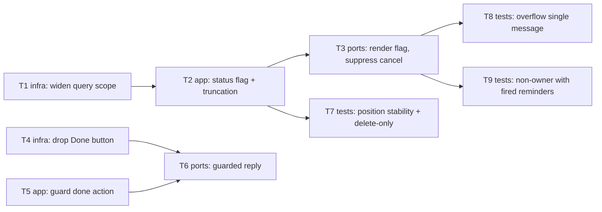

# Epic — keep-fired-reminders-visible

> **Spec:** [spec.md](../spec.md) · **Design:** [sad.md](../sad.md) · **Data model:** [data-model.md](../data-model.md) · **ADRs:** [adr/](../adr/)

## Goal

Widen `/list` to include fired-but-undeleted reminders alongside scheduled ones, clearly flag each
entry's status, hold every entry at a stable capture-order position, and retire the ambiguous
`Done` action so Delete is the sole way a reminder leaves the list (spec §2 Goals).

## Scope

- **In:** `app` (list use-case, resolve-reminder use-case), `ports` (list-handler, resolve-handler),
  `infra` (repository query scope, Telegram keyboard) — no `domain` change (ADR-0001 leaves `done`
  dormant), no schema change (ADR-0002, `data-model.md`).
- **Out:** deletion from the list itself, archiving/capping the list, rescheduling from the list,
  multi-user support (spec §3 Non-goals).

## Task map

## Tasks

See [tracker.md](./tracker.md) for status. Machine contract: [tasks.json](../tasks.json).

| # | Task | Layer | Blocked by | DoD (short) |
|---|---|---|---|---|
| T1 | Widen repository query scope to pending+fired, ordered by capture order | infra | — | read returns pending+fired ordered by `id ASC` |
| T2 | List use-case: per-row status flag + capture-order truncation | app | T1 | view model flags rows, truncates by earliest-added |
| T3 | List handler: render scheduled/fired flag, suppress Cancel on fired rows | ports | T2 | rendered message shows flag, no Cancel on fired |
| T4 | Telegram gateway: drop the Done button from the fired-reminder keyboard | infra | — | new fired messages carry only Snooze + Delete |
| T5 | Resolve-reminder use-case: guard the done action before any domain call | app | — | `done` intercepted, `resolveDone` never invoked |
| T6 | Resolve handler: map guarded done outcome to uniform "no longer active" reply | ports | T5, T4 | stale done tap replies gracefully, no state change |
| T7 | Integration test: position stable across fire/deliver/snooze; only delete removes | tests | T2 | AC-03/AC-04 assertions pass |
| T8 | Integration test: oversized visible set sends exactly one message + overflow indicator | tests | T3 | AC-08 assertion passes |
| T9 | Extend owner-gate test: non-Owner sees nothing when fired reminders exist | tests | T3 | AC-07 assertion passes |

## Risks / Hard rules

- No `domain` change — `done` stays defined but permanently unreachable (ADR-0001); do not remove
  the state or the `fired → done` transition.
- No schema change / migration — `id` already serves as the capture-order key (ADR-0002); do not
  add a `position` column.
- Exactly one bot message per `/list` regardless of branch (spec §6 NFR, sad §10 QG-4) — T2/T3/T8
  must not introduce a second send on the overflow path.
- The `done` guard belongs in `app`/`ports`, ahead of any domain call — never a caught
  `InvalidStateTransitionError`, since `fired → done` is itself valid (ADR-0001, sad §4 point 2).
