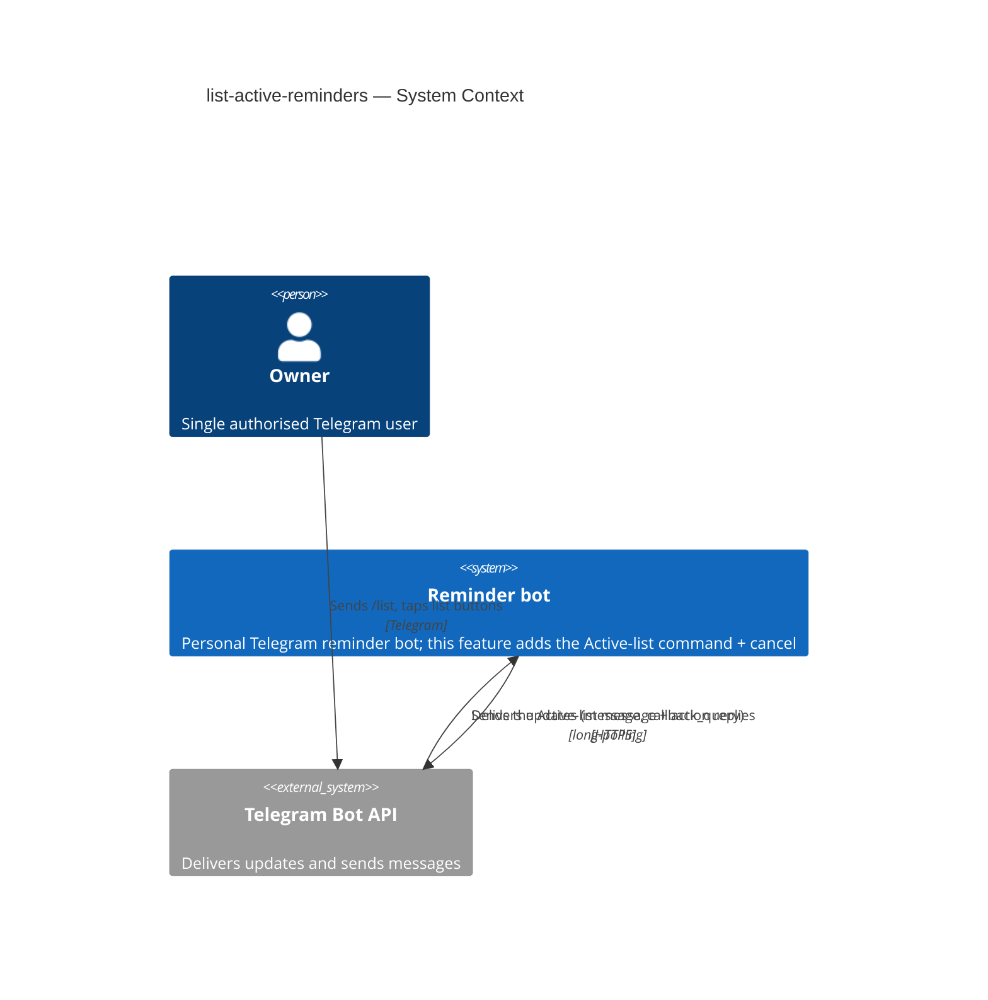
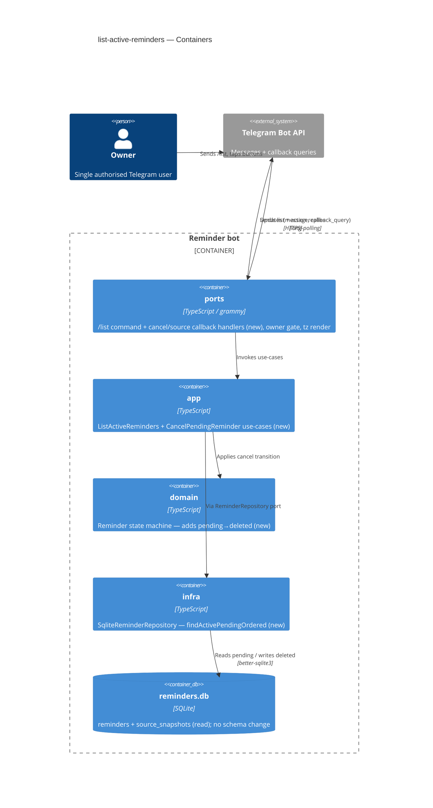
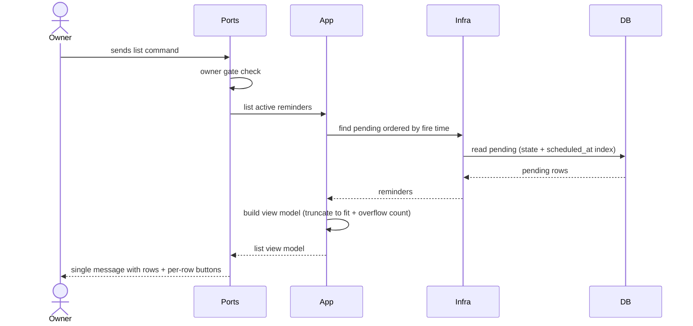

# Software Architecture Document — list-active-reminders

<!-- 12 Arc42 sections. C4 Context (L1) inline in §3, C4 Container (L2) inline in §5. -->
<!-- Numbers in §10 come VERBATIM from spec.md §6 NFR — no inventing, no rounding. -->

## 1. Introduction and goals

**Intent.** Give the single Owner of the personal Telegram reminder bot on-demand visibility into scheduled work: a `/list` command that returns one message enumerating every Active (`pending`) reminder ordered by fire time, each carrying two inline actions — go-to-source and cancel. Cancelling removes a reminder before it fires. This closes the "what do I have coming up?" gap left by the reactive capture→fire→resolve loop and is the prerequisite for any later management features.

**Top-3 quality goals (1-liners; full scenarios in §10):**

1. Owner-only safety — the list and its actions never reveal or mutate anything for a non-Owner.
2. Bounded output — exactly one bot message per list command, always within the anti-flood budget.
3. Responsiveness — p95 ≤ 1000 ms from command receipt to message sent.

**Stakeholders.**

| Role | Interest | Sign-off owner? |
|---|---|---|
| Owner | Requests the Active list; cancels / jumps to source from it | No |
| Tech Lead | SAD approval | Yes |
| Security Lead | Confirms owner-gate covers the new cancel mutation | No |

<!-- Decision overrides (¶4) — populated by the critic resolution loop, empty otherwise. -->

## 2. Constraints

**Technical.**
- TypeScript 5.4 (ES2022, NodeNext), Node.js `>=22`.
- `grammy` 1.21 + `@grammyjs/conversations` 1.2 (Telegram); `better-sqlite3` 9.4 (synchronous SQLite), store `reminders.db`.
- Hexagonal ports-and-adapters layering — inherited from telegram-reminder ADR-0006 (`domain` ← `app`/`ports` ← `infra`).
- Telegram Bot API limits: `callback_data` ≤ 64 bytes, message text ≤ 4096 chars, 48h message-delete window.

**Organisational.**
- Effort budget: size S (a small handful of PRs).
- No hard external deadline.
- Solo maintainer (Mykhailo Podaniev).

**Conventions.**
- `docs/architecture-map.md` is the cited convention reference (no separate convention file exists).
- Manual constructor DI in the composition root `src/main.ts`; domain custom error classes (`src/domain/errors.ts`); Vitest co-located `__tests__/*.test.ts`; Flyway-style `NN_*.{up,down}.sql` migrations.

**Regulatory / external.**
- Single-Owner bot; data is confidential (the Owner's forwarded personal messages). No new PII or fields are introduced (spec §6.1).
- No new authorization boundary — the new cancel mutation reuses the existing single-Owner gate.

## 3. Context and scope

The Reminder bot is a single-Owner Telegram bot that captures messages and fires them at a scheduled time. This feature adds a read view (the Active list) plus one new mutation (cancel a `pending` reminder) over the data that already exists. The trust boundary is the existing single-Owner gate: every `/list` command and every list action button is processed only for the configured Owner; all other Telegram users are rejected and see nothing.

<!-- brownfield: extends telegram-reminder (hexagonal TS bot, grammy + better-sqlite3); reuses the existing reminders/source_snapshots tables, the idx_reminders_state_scheduled_at index, the owner gate, tz utils, and the deep-link/inline-fallback rule. No schema change. -->

**External systems (in / out):**

| Actor or system | Type | Interaction |
|---|---|---|
| Owner | Person | Sends `/list` (typed or from the command menu); taps cancel / go-to-source buttons |
| Telegram Bot API | System (external) | Delivers updates (`message`, `callback_query`) via long-polling; receives the bot's outgoing messages |

**C4 Context (L1):**



## 4. Solution strategy

**Target surface:** `backend-service` — the existing single bot process. The feature adds no new deployable unit and no UI surface in the C4 sense (Telegram inline keyboards are rendered inside the `ports`/`infra` adapters). Surface selection is inherited from telegram-reminder, so it does not cross the blast-radius gate; it is recorded in frontmatter `target_surfaces`.

**Top strategic choices (the seeds for ADRs):**

1. **Reuse the hexagonal ports-and-adapters layering** — the list use-case and cancel use-case land in `app/`, their Telegram handlers in `ports/`, and the new lifecycle transition in `domain/`. Inherits telegram-reminder ADR-0006; no new structural decision.
2. **Cancel via the existing `deleted` terminal state** — adds a `pending` → `deleted` transition to the state machine rather than a new `cancelled` state, keeping the lifecycle and schema unchanged. This intentionally reopens the telegram-reminder Edit #8 restriction (deletion was `fired`-only). → **ADR-0001**.
3. **Render the Active list as an immutable point-in-time snapshot** — the list message is never edited after send; cancel/source replies are separate messages, and a tap on an entry that has since changed state is a graceful no-op. → **ADR-0002**.
4. **Honour the single-message bound with truncation + an overflow indicator** — when the Active set exceeds one message's capacity, list the soonest-firing reminders that fit and append "… ще M" rather than sending more messages. "Fit" = `min(fixed max-count, Telegram 4096-char limit)`. → **ADR-0003**.

The read path reuses the existing `idx_reminders_state_scheduled_at` index (`state='pending' ORDER BY scheduled_at`), so there is **no schema change and no new migration**. Tactical decisions in later sections trace to these seeds.

## 5. Building block view

Hexagonal (ports-and-adapters). The feature is a thin vertical slice: two new use-cases in `app/`, two new Telegram handlers (command + callbacks) in `ports/`, one new transition in `domain/`, and one new read method on the existing repository in `infra/`. Everything else (owner gate, tz utils, deep-link/inline fallback, anti-flood, callback encoding) is reused.

**Internal decomposition (new / touched):**

```
src/
├── domain/
│   └── state-machine.ts        + pending → deleted transition (cancel); reuse domain error pattern
├── app/
│   ├── use-cases/
│   │   ├── list-active-reminders.ts    NEW — query pending ordered by fire time → view model (truncate + overflow)
│   │   └── cancel-pending-reminder.ts  NEW — load by id, guard pending, transition → deleted, persist
│   └── ports/
│       └── reminder-repository.ts      + findActivePendingOrdered() (read; reuse save)
├── infra/
│   └── db/sqlite-reminder-repository.ts  + findActivePendingOrdered (uses idx_reminders_state_scheduled_at)
└── ports/
    ├── handlers/list-handler.ts        NEW — /list command + cancel/source callback handlers
    └── router.ts                       + register /list + command-menu entry; wire callbacks
```

**C4 Container (L2):**



## 6. Runtime view

**Critical flow 1: render the Active list**



**Critical flow 2: cancel from the list (with stale no-op branch)**

```mermaid
sequenceDiagram
    actor Owner
    participant Ports
    participant App
    participant Domain
    participant Infra
    Owner->>Ports: taps cancel on a listed reminder
    Ports->>Ports: owner gate check
    Ports->>App: cancel pending reminder (id)
    App->>Infra: load reminder by id
    Infra-->>App: reminder
    App->>Domain: transition pending to deleted
    alt reminder still pending
        Domain-->>App: deleted
        App->>Infra: persist deleted
        App-->>Ports: cancelled
        Ports-->>Owner: confirmation (separate message); list left unchanged
    else no longer pending (firing/fired/done/deleted/expired)
        Domain-->>App: transition rejected
        App-->>Ports: not active
        Ports-->>Owner: uniform "no longer active" message (no further change)
    end
```

The `sequences` stage covers the remaining ACs (empty list AC-02, source-link fallback AC-06, non-Owner rejection AC-05, entry-point parity AC-07).

## 7. Deployment view

<!-- N/A: reuses the existing single bot process / deployment unit — no new container, replica, or infra change. -->

No deployment change: the feature adds code to the existing bot process and reads/writes the existing `reminders.db`. Monitoring reuses the established structured timing log (for the p95 leaf in §10) and the global `bot.catch` handler (the KPI target of 0 unhandled list-action errors over any 30-day window).

## 8. Crosscutting concepts

| Concept | Convention | Where defined |
|---|---|---|
| Authorization | Owner gate on the `/list` command **and** every list callback (`OWNER_TELEGRAM_ID`) — reuse | `src/main.ts` auth gate (map §Constraints) |
| Error handling | Domain sentinel error for an invalid cancel transition → handler maps it to the uniform "no longer active" reply (AC-04) | `src/domain/errors.ts` pattern |
| Callback encoding | Encode action tag + `reminder_id` in `callback_data` (≤ 64 bytes) — reuse the fired-reminder button scheme | `src/infra/telegram/grammy-telegram-gateway.ts` |
| Source link availability | Build a deep link if the source chat has a public username, else fall back to inline captured content (AC-06) — reuse the fired-reminder rule | existing fired-reminder source flow |
| Timezone rendering | Fire time shown as an absolute local date-time in the Owner's home timezone from `/settings` — reuse tz utils | `ports` tz utils |
| Bounded output / anti-flood | Exactly 1 message per `/list`; truncation honours `min(max-count, 4096 chars)`; the list contributes ≤ 1 to the 10-msgs/60-s budget | ADR-0003, spec §6 |
| Internationalisation | Ukrainian message text, single language | existing convention |
| Observability | Structured timing log around the list use-case (p95 leaf); `bot.catch` for unhandled errors | existing |

## 9. Architecture decisions

| # | Title | Status | Section |
|---|---|---|---|
| 0001 | Reuse the `deleted` terminal state for cancelling a pending reminder | Accepted | §4 |
| 0002 | Render the Active list as an immutable point-in-time snapshot | Accepted | §4 |
| 0003 | Truncate the Active list to one message with an overflow indicator | Accepted | §4 |

ADR files live under `docs/features/list-active-reminders/adr/NNNN-<title>.md`.

## 10. Quality requirements

**QG-1. Owner-only safety**
- **When:** a Telegram user who is not the Owner sends the list command or taps a list action button.
- **Then:** the bot reveals no reminders and performs no action (every list command and list action is rejected for any non-Owner).
- **How verify:** unit test on the auth gate (spec §6 — Owner-only row).

**QG-2. Bounded output / anti-flood**
- **When:** the Owner sends the list command with more Active reminders than the per-window message limit allows.
- **Then:** exactly 1 bot message regardless of reminder count, and the response never exceeds the ≤ 10 bot messages / 60 s window (the list contributes ≤ 1).
- **How verify:** integration test asserting send-count = 1 for the list command (spec §6 — Messages-per-response + Anti-flood rows).

**QG-3. Responsiveness**
- **When:** the Owner sends the list command.
- **Then:** ≤ 1000 ms p95 from command receipt to message sent.
- **How verify:** timing log around the list use-case (spec §6 — Latency p95 row).

**QG-4. Accuracy**
- **When:** the list is requested under a fixed clock.
- **Then:** the list reflects the `pending` set at query time, ordered by fire time ascending.
- **How verify:** integration test with a fixed clock (spec §6 — Accuracy row).

## 11. Risks and technical debt

| Risk / debt | Severity | Mitigation | Owner |
|---|---|---|---|
| Stale-list race — a reminder changes state between render and the cancel tap | Low | AC-04 uniform "no longer active" no-op; the domain transition guard rejects any non-`pending` source state | Mykhailo Podaniev |
| Overflow truncation hides far-future reminders until the earlier ones clear | Low | "… ще M" overflow indicator surfaces the hidden count; pagination is a deliberate Non-goal | Mykhailo Podaniev |
| `callback_data` 64-byte limit if button encoding grows | Low | Encode only an action tag + `reminder_id`, reusing the existing compact fired-reminder scheme | Mykhailo Podaniev |

**Accepted debt (acceptable in v1, plan to fix later):**
- No pagination — single-message truncation is acceptable for a single-Owner personal bot; revisit only if Active sets routinely overflow.
- No live refresh of the list message (immutable snapshot per ADR-0002) — reschedule / live-edit from the list is deferred (spec §3 Non-goal, §8 open question).

## 12. Glossary

| Term | Meaning |
|---|---|
| Active reminder | A Reminder in the `pending` state — scheduled, not yet fired/cancelled/resolved. The unit the list shows. |
| Active list | The single message enumerating all Active reminders ordered by fire time, each with its own action buttons. |
| Cancel | The Owner action that transitions a reminder `pending` → `deleted` so it never fires (distinct from resolve-delete on a `fired` reminder). |
| Immutable snapshot | The list message is frozen at render time; later taps act on the reminder's current state, but the rendered message is never edited (ADR-0002). |
| Overflow indicator | The "… ще M" suffix appended when the Active set exceeds one message's capacity, M = the count not shown (ADR-0003). |
