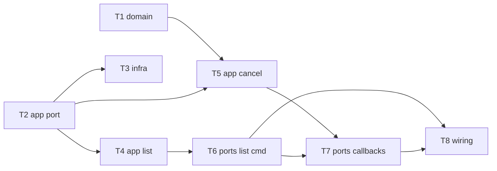

# Epic — list-active-reminders

> **Spec:** [spec.md](../spec.md) · **Design:** [sad.md](../sad.md) · **ADRs:** [adr/](../adr/)
> (No `data-model.md` / `openapi.yaml` — size S, no schema change; Telegram command/callback surface, not HTTP.)

## Goal

Give the Owner on-demand visibility into scheduled work: a `/list` command that returns one message of every Active (`pending`) reminder ordered by fire time, each with go-to-source and cancel inline actions. Delivers spec §2 Goals: see all upcoming reminders at a glance, and prune one before it fires — without weakening the owner-only / anti-flood posture.

## Scope

- **In:** `domain` (pending→deleted transition), `app` (list + cancel use-cases, repo port read method), `infra` (SQLite read), `ports` (list command + cancel/source callbacks), `wiring` (router + command-menu + DI). Tests are inline per task (TDD).
- **Out:** rescheduling from the list, showing `fired`/`firing` reminders, search/filter/grouping, multi-user (spec §3). No schema change / migration; no `ui` layer (backend-service surface).

## Task map

Parallel start: **T1** (domain) and **T2** (repo port) have no deps.

## Tasks

See [tracker.md](./tracker.md) for status. Machine contract: [tasks.json](../tasks.json).

| # | Task | Layer | Blocked by | DoD (short) |
|---|---|---|---|---|
| T1 | pending→deleted transition + sentinel | domain | — | transition allowed; non-pending rejected with sentinel |
| T2 | findActivePendingOrdered() on repo port | app | — | port declares the ordered-read method; compiles |
| T3 | implement findActivePendingOrdered (SQLite) | infra | T2 | ordered pending read via existing index; fixed-clock test |
| T4 | ListActiveReminders use-case (truncate + overflow) | app | T2 | empty / normal / overflow view models |
| T5 | CancelPendingReminder use-case | app | T1, T2 | guard pending, persist deleted, surface sentinel |
| T6 | /list command handler (+ empty) | ports | T4 | exactly 1 message; owner gate; tz render |
| T7 | cancel + go-to-source callbacks | ports | T5, T6 | confirm/no-op; deep-link/inline fallback |
| T8 | wire /list + command-menu + DI | wiring | T6, T7 | both entry points equal; owner gate on routes |

## Risks / Hard rules

- **Exactly 1 message per `/list`** (spec §6, AC-08) — truncate with "… ще M", never send extra messages. Action-button replies are separate messages.
- **Owner-only on the command AND every callback** (spec §6.1, AC-05) — reuse the existing auth middleware; no new authz boundary.
- **No schema change** (sad §4) — the read reuses `idx_reminders_state_scheduled_at`; do not add a migration.
- **Immutable list snapshot** (ADR-0002) — never edit the rendered list message; a tap on a since-changed entry is a graceful no-op (AC-04).
- **p95 ≤ 1000 ms** (spec §6) — keep the read on the existing index.
