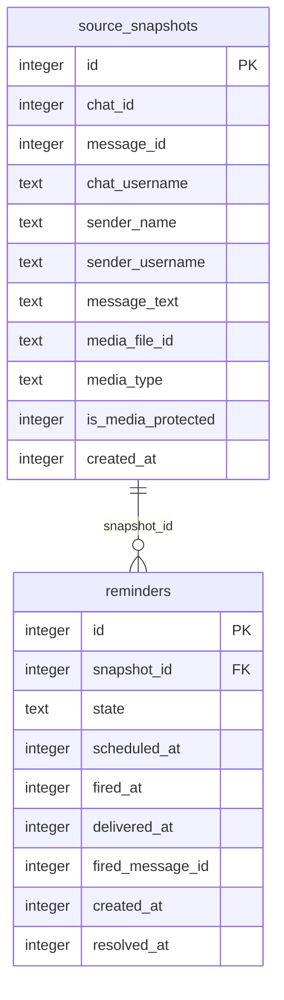

# Data model — plain-typed-message-capture

**No schema change.** This is a legitimate, confirmed outcome — `spec.md` §6.1 states the hard constraint verbatim ("reuses the existing `messageText` field; no new field or table"), and `sad.md` §4 pillar 3 / §2 Technical repeat it as binding. A typed-origin reminder reuses the **existing** `source_snapshots` + `reminders` tables unchanged, distinguishing itself only by *values* (`chat_id: 0, message_id: 0, chat_username: NULL`) — the existing null-sentinel already documented in `sad.md` §12 Glossary — not by a new column, table, or discriminator.

No entities are added or altered by this feature. The two tables below are the **existing** entities this feature reads/writes, documented here only because `sad.md` §6's sequence diagrams reference them (Flow 1: writes both; Flow 2: reads both) — nothing here is new relative to `telegram-reminder`'s already-shipped schema.

## ER diagram

<!-- Unchanged from telegram-reminder's existing schema — reproduced here only as the read/write target of this feature's flows. -->



## Entities

### `source_snapshots` (unchanged)

| Column | Type | Constraints | Notes |
|---|---|---|---|
| `id` | INTEGER | PK, AUTOINCREMENT | |
| `chat_id` | INTEGER | NOT NULL | **typed-origin capture (this feature) writes `0`** — the existing no-source-chat sentinel (`sad.md` §12), not a new value space |
| `message_id` | INTEGER | NOT NULL | typed-origin capture writes `0`, same sentinel |
| `chat_username` | TEXT | nullable | typed-origin capture writes `NULL` — this is what makes `hasPublicDeepLink()` return `false` and routes "🔗 Джерело" to the stored text (AC-06) |
| `sender_name` / `sender_username` | TEXT | nullable | typed-origin capture writes `NULL` — no forwarded sender to record |
| `message_text` | TEXT | nullable | **the field this feature reuses verbatim** — holds the Owner's typed text exactly as `messageText` already holds a forwarded message's text |
| `media_file_id` / `media_type` | TEXT | nullable | always `NULL` for typed-origin — this feature explicitly excludes media (spec §3 Non-goals) |
| `is_media_protected` | INTEGER | NOT NULL DEFAULT 0 | `0` for typed-origin — no media |
| `created_at` | INTEGER | NOT NULL | unix epoch ms, unchanged semantics |

**Aggregate root:** `reminders` (owns `source_snapshots` 1:1 per capture).
**Access patterns:** unchanged — no new query shape introduced by this feature.
**Constraints:** unchanged from the existing migration (`migrations/02_create_source_snapshots.up.sql`).

### `reminders` (unchanged)

| Column | Type | Constraints | Notes |
|---|---|---|---|
| `id` | INTEGER | PK, AUTOINCREMENT | |
| `snapshot_id` | INTEGER | NOT NULL, FK → `source_snapshots(id)` | points at the typed-origin snapshot exactly as it would a forwarded one |
| `state` | TEXT | NOT NULL CHECK (...) | typed-origin reminders enter the identical `awaiting_time → pending → firing → fired → done\|deleted\|expired` machine (`sad.md` §8) |
| `scheduled_at`, `fired_at`, `delivered_at`, `fired_message_id`, `created_at`, `resolved_at` | INTEGER | as existing | no behavior change for typed-origin rows |

**Aggregate root:** root.
**Access patterns:** unchanged — `idx_reminders_state_scheduled_at` (scheduler tick) and `idx_reminders_snapshot_id` (FK) already cover typed-origin rows identically to forwarded ones; no new query is introduced by AC-01/AC-01b/AC-04/AC-04b/AC-05/AC-06/AC-07 (all read/write through the existing repository methods with existing predicates).
**Constraints:** unchanged from the existing migration (`migrations/03_create_reminders.up.sql`).

## Indexes

No new index. Both existing indexes already cover this feature's access patterns:

| Index | Columns | Query it serves |
|---|---|---|
| `idx_reminders_state_scheduled_at` (existing) | `reminders(state, scheduled_at)` | scheduler tick — identical for typed- and forwarded-origin rows, `sad.md` §6 unchanged reference to Flow 1 continuation |
| `idx_reminders_snapshot_id` (existing) | `reminders(snapshot_id)` | Flow 2 source lookup (`sad.md` §6) — read reminder + snapshot by id, same path for both origins |

## Test fixtures

No new factory needed — the existing `buildSourceSnapshot()` (`test/helpers/factories.ts:47`) already accepts `overrides`, so a typed-origin fixture is expressed as a call-site override, not a new builder:

```ts
buildSourceSnapshot({
  chat_id: 0,
  message_id: 0,
  chat_username: null,
  sender_name: null,
  sender_username: null,
  message_text: "buy milk",
});
```

- `buildSourceSnapshot(...)` (existing, `test/helpers/factories.ts:47`) — builds a `source_snapshots` row; typed-origin tests pass the sentinel overrides above instead of the default forwarded-message values.
- `buildReminderRow(...)` (existing, `test/helpers/factories.ts:65`) — unchanged; a typed-origin reminder row is built identically to a forwarded one (it only references `snapshot_id`).
