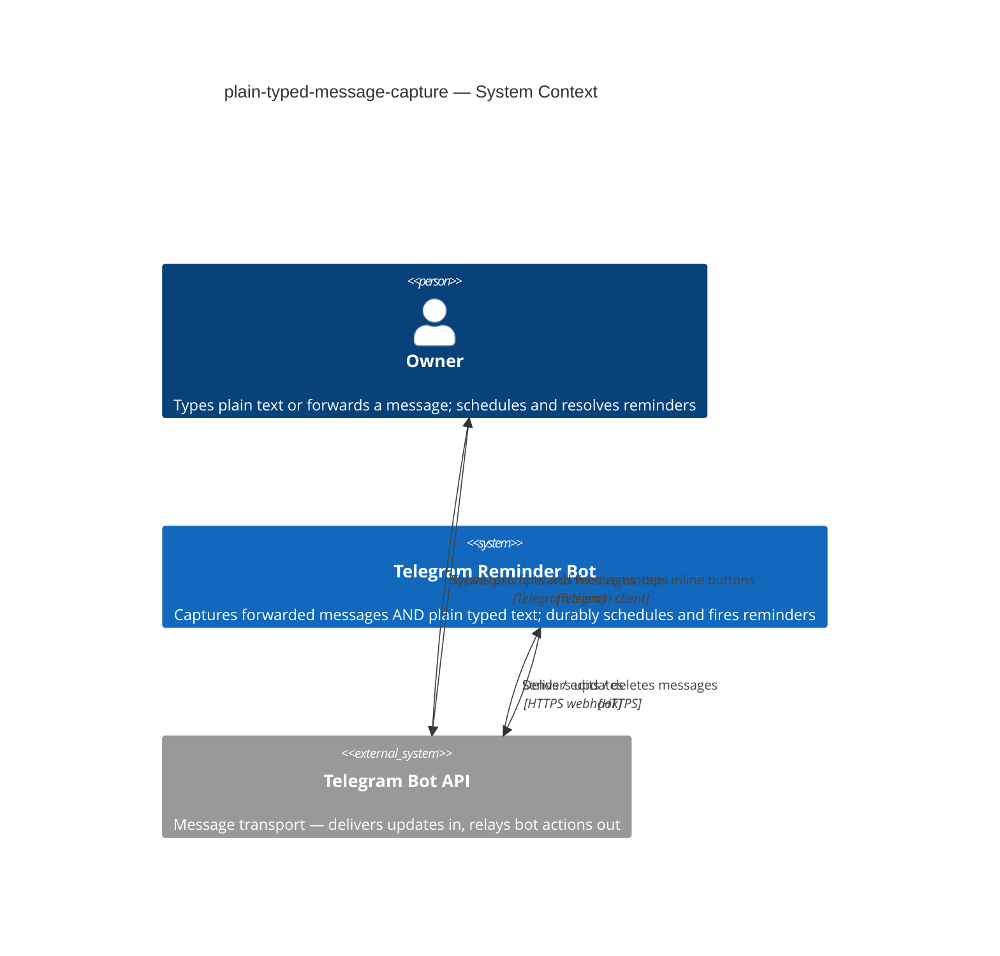
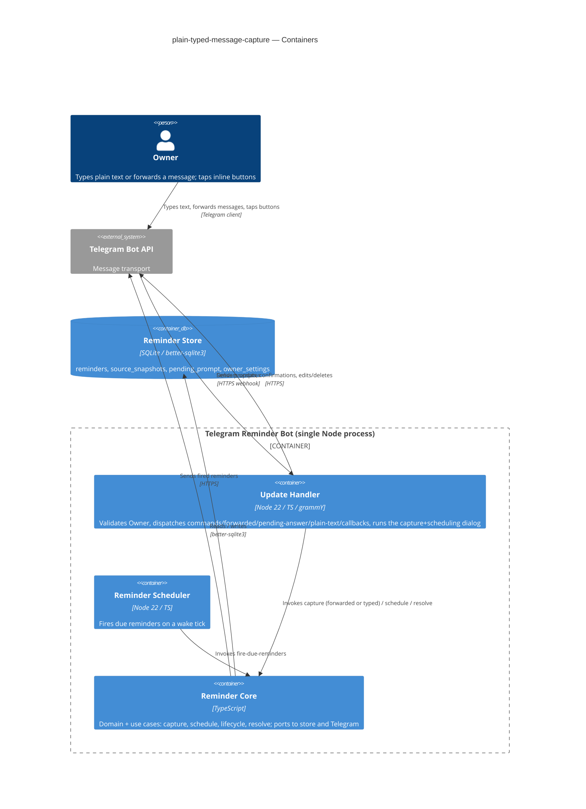
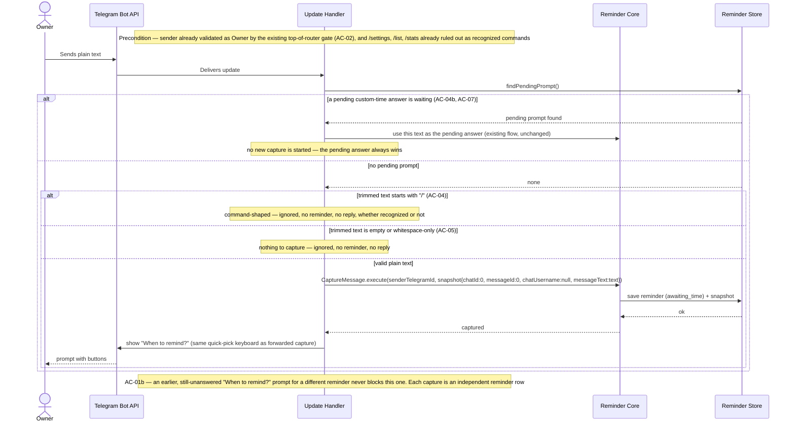
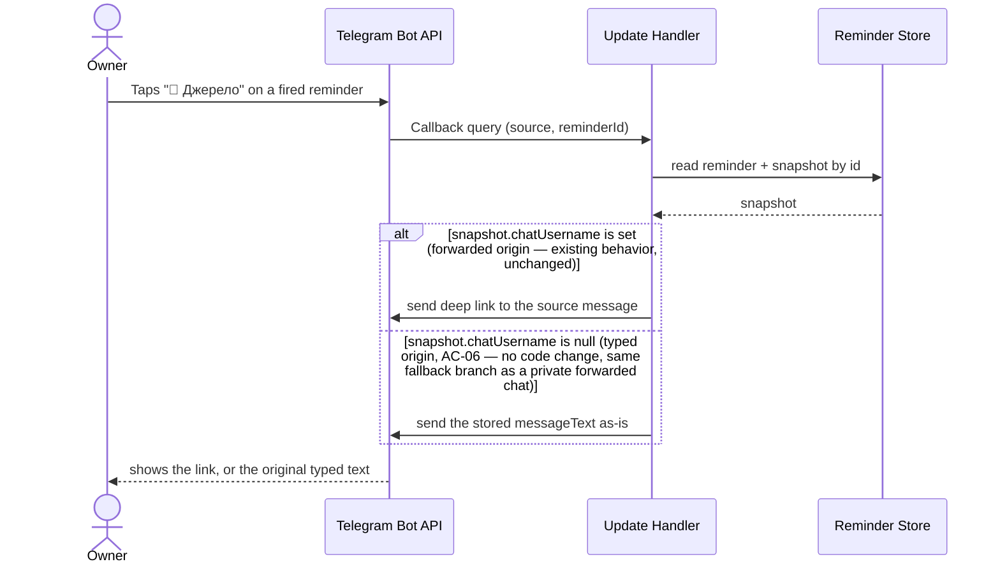

# Software Architecture Document — plain-typed-message-capture

<!-- 12 Arc42 sections. Empty section → <!-- N/A: <one-line reason> -->. -->
<!-- C4 Context (L1) lives inline in §3. C4 Container (L2) lives inline in §5. -->
<!-- Numbers in §10 come VERBATIM from spec.md §6 NFR — no inventing, no rounding. -->

## 1. Introduction and goals

<!-- 🎯 Why: durable memory of «what + the three dominant qualities + who cares». A year from
     now nobody recalls which three qualities were critical for this system.
     📋 Write: 1 ¶ intent + 3 lines of top-3 quality goals + a stakeholders table.
     ¶4 is the override slot — critic `Override` resolutions emit «Decision override: <headline>
     — rationale: <reason>» bullets here so downstream skills see the deliberate choice. -->

**Intent.** Add a second entry point to the existing telegram-reminder bot: the Owner can type plain text directly into the chat, and the bot treats it exactly like a forwarded message's content — same capture, same "When to remind?" quick-pick/custom-time flow, same firing/snooze/resolve behavior, just with no source chat to point back to. Today capture is gated on "something already exists to forward"; this removes that gate for the bot's single Owner (spec §1–§2).

**Top-3 quality goals (1-liners; full scenarios in §10):**

1. **No spurious captures** — zero reminders are ever created from command-shaped or empty/whitespace text (spec §2 Goal 3, §6 NFR).
2. **Same-speed response** — the "When to remind?" prompt appears ≤ 1000 ms after a typed message, matching the existing forwarded-capture path's budget (spec §6 NFR).
3. **Zero regression on the existing path** — the forwarded-message capture test suite stays at 100% pass rate after this ships (spec §7 KPI).

**Stakeholders.**

| Role | Interest | Sign-off owner? |
|---|---|---|
| Owner | Sole user — gains a second capture entry point; also the builder | No |
| Tech Lead | SAD approval | Yes |

<!-- Decision overrides (¶4) — populated by the critic resolution loop, empty otherwise. -->

## 2. Constraints

<!-- 🎯 Why: §4 strategy only works when §2 has fixed WHAT IS ALREADY FIXED — stack, versions,
     deadline, regulatory. This is an input, not an output.
     📋 Write: four blocks — Technical / Organisational / Conventions / Regulatory.
     📌 Pin versions («<datastore> 18», not «<datastore>»); «Q3 deadline — hard», not «ideally».
     Never N/A — every feature inherits at least Conventions + Technical. -->

**Technical.**
- Language + runtime: **Node.js ≥22 + TypeScript 5.4** — unchanged (telegram-reminder ADR-0001).
- Framework: **grammY 1.21 + @grammyjs/conversations 1.2** — unchanged.
- Datastore: **embedded SQLite via better-sqlite3 9.4**, same `reminders.db`, same `source_snapshots` table. **No new field or table** — a hard constraint from spec §6.1 ("reuses the existing `messageText` field; no new field or table"), binding on §4/§5 below.
- Architecture convention: **ports-and-adapters (hexagonal)** — unchanged (telegram-reminder ADR-0006). This feature extends the `ports` layer only.
- Deployment: **webhook mode, scale-to-zero on Fly.io**, woken by a GitHub Actions "Wake scheduler" cron hitting `/wake` — the current production posture (supersedes telegram-reminder's original long-polling ADR-0003, superseded in practice by the later `webhook-cron-wake` feature). No infra change from this feature.

**Organisational.**
- Personal project, solo Owner/builder, no fixed deadline — unchanged.
- Effort budget: 1 PR, ≤1 day (`.size` = XS).

**Conventions.**
- Follows `docs/architecture-map.md` conventions: manual constructor DI in `src/main.ts`, Vitest with co-located `__tests__/*.test.ts`, no lint/static-analysis configured.
- New behavior lives entirely in `src/ports/` — a sibling handler next to the existing `handleForwardedMessage`, and one new precedence branch in `router.ts` — reusing `src/app/use-cases/capture-message.ts` verbatim (no app-layer change).

**Regulatory / external.**
- Data classification: **internal** — unchanged (spec §6.1); typed text is stored through the identical mechanism as forwarded text.
- AuthZ: the existing single Owner-ID gate, checked once at the top of every update in `router.ts` before any handler dispatch, already covers this new entry point — no new boundary (spec §6.1, AC-02).
- No new field or table (spec §6.1) — see Technical above; this is the binding constraint behind the §4 source-representation choice.

## 3. Context and scope

<!-- 🎯 Why: draws the SYSTEM BOUNDARY — who talks to it from outside, where the trust zone ends.
     Without §3, §5 and §8 (authorization) blur — unclear what's «inside» vs «outside».
     📋 Write: 2–3 sentences of business context + an external-systems table + a C4Context block.
     📌 «External: none (deliberate, no third-party in v1)» is itself a decision worth stating.
     Trust boundary — the line past which you don't trust data without checking it.
     Never N/A — greenfield still draws the planned actors + external systems. -->

The system is the same personal Telegram bot serving a single Owner. The Owner still never talks to the bot directly — every interaction passes through the Telegram client and the **Telegram Bot API**, the sole external system. This feature adds no new actor and no new external system; it only widens what counts as "capture-worthy input" arriving over the same channel — from "a forwarded message" to "a forwarded message, or plain typed text."

<!-- brownfield: docs/architecture-map.md was stale on the files this feature touches (predates the webhook-cron-wake, list, and stats features, and still describes an in-memory pendingCustom map since replaced by a durable PendingPromptRepository) — grounded instead via a targeted live read of src/ports/router.ts, capture-conversation.ts, pending-prompt-repository.ts, source-snapshot.ts, source-handler.ts, capture-message.ts. -->

**Trust boundary:** unchanged — anything arriving from Telegram is untrusted until `sender_id` is checked against the configured Owner-ID; non-Owner updates are silently dropped before any handler runs (spec §6.1, AC-02).

**External systems (in / out):**

| Actor or system | Type | Interaction |
|---|---|---|
| Owner | Person | Types plain text (new) or forwards a message (existing), taps inline buttons, receives fired reminders — all through the Telegram client |
| Telegram Bot API | System (external) | Delivers updates to the bot (in); accepts the bot's sends/edits/deletes (out) |

**C4 Context (L1):**



The Context is unchanged from telegram-reminder's — the same Owner, the same one external system, the same trust boundary. The only thing that widens is which incoming updates the bot treats as "capture-worthy." Rendered to [`_diagrams/c4-context.png`](./_diagrams/c4-context.png).

## 4. Solution strategy

<!-- 🎯 Why: the 3–4 STRATEGIC PILLARS every ADR grows from. Without §4 each ADR looks random —
     there's no umbrella. ⭐ The densest section — the blast-radius gate fires almost always here
     (decisions are irreversible + multi-module).
     📋 Write: 3–4 choices; each a heading + 2–3 sentences of rationale.
     📌 «Store content as a table of typed blocks» is a pillar — ADR-0001 grows from it. -->

**Target surface: `backend-service` (unchanged).** One Node process still hosts the update handler and the in-process scheduler; this feature introduces no new deployable unit and no new surface. `target_surfaces: [backend-service]`.

**Top strategic choices (the seeds for tactical decisions in §5/§6/§8):**

1. **Additive second entry point, zero new machinery downstream of capture** — the new plain-text branch feeds the exact same `CaptureMessage` use-case and the same quick-pick/custom-time scheduling flow already used for forwarded messages (spec's committed approach, §1). No new use-case, no duplicated scheduling logic — only the entry point differs.
2. **Router-level precedence decides intent before capture runs** — the update dispatch order in `router.ts` becomes: recognized commands (`/settings`, `/list`, `/stats`) → forwarded message → **pending custom-time answer** → **[new] plain text** → callback queries. Placing the new branch *after* the pending-prompt check (not before it, and not as a separate middleware layer) is what makes AC-04b/AC-07 hold structurally: a pending time-answer always intercepts the text before the new branch is ever reached, with no extra guard needed. This ordering choice has a legitimate alternative (a different position, or a dedicated middleware stage) but reordering later is a same-file, same-day change — it doesn't clear the irreversibility bar, so it's decided here inline rather than promoted to an ADR.
3. **No schema change — reuse the existing null-sentinel for "no source chat"** — a typed-origin reminder's `SourceSnapshot` sets `chatId: 0, messageId: 0, chatUsername: null, messageText: <typed text>`. `hasPublicDeepLink()` (`src/domain/value-objects/source-snapshot.ts`) already returns `false` whenever `chatUsername` is `null`, so the existing fallback branch in `source-handler.ts` (show `snapshot.messageText` instead of a link) fires with **zero code change**, satisfying AC-06. This is fixed by spec §6.1's own constraint ("no new field or table") — the alternative (an explicit `sourceType` discriminator column) is excluded by that constraint, not weighed against it here; see §9 for why this stays inline rather than becoming an ADR.

Each tactical decision in §5/§6/§8 traces to one of these three pillars.

## 5. Building block view

<!-- 🎯 Why: INTERNAL DECOMPOSITION — modules, containers, datastores. The static topology: who
     may talk to whom. Without §5, §6 (the flows) has no vocabulary of participants.
     📋 Write: 1 ¶ on the style (layered / hexagonal / clean / event-driven) + a folder tree + a
     C4Container block.
     📌 Draw ONE Container per declared `target_surface` (frontmatter): a fullstack
     [backend-service, web-frontend] = a backend-API container + a web/SPA container; a
     [backend-service, mobile-app] = the API + the mobile app. The Container(web, …) line below is
     just one surface's container — swap/add per what was declared in §4. → _shared/surfaces.md
     📌 e.g. «web app, content API, media worker, datastore, object store, CDN». -->

**Ports-and-adapters (hexagonal), unchanged.** This feature touches exactly one layer — `ports` — and reuses `app`/`domain`/`infra`/`scheduler` verbatim. The new content is a sibling function next to `handleForwardedMessage` (closest precedent: same file `capture-conversation.ts`, same snapshot-building + quick-pick-showing shape), reusing the existing `buildQuickPickKeyboard` helper (exported for that purpose), plus one new precedence branch in `router.ts` inserted after the existing pending-custom-time check and before callback-query dispatch.

**Internal decomposition (unchanged tree, annotated with what this feature touches):**

```
src/
├── domain/      unchanged — SourceSnapshot's existing null-sentinel already models "no source chat"
├── app/         unchanged — CaptureMessage.execute() reused verbatim (its snapshot input is source-agnostic)
├── infra/       unchanged — no migration, no row-mapper change (no new field or table, spec §6.1)
├── ports/       + new plain-text branch in router.ts, after the pending-prompt check
│                + new handler in capture-conversation.ts, sibling of handleForwardedMessage
│                + source-handler.ts unchanged — its existing null-chatUsername fallback already
│                  covers a typed-origin "🔗 Джерело" tap
└── scheduler/   unchanged
```

**C4 Container (L2):** unchanged from telegram-reminder's — same four containers, same datastore. The new behavior is invisible at this level; it lives entirely inside Update Handler. Rendered to [`_diagrams/c4-container.png`](./_diagrams/c4-container.png).



## 6. Runtime view

<!-- 🎯 Why: the RUNTIME FLOW of 1–2 critical scenarios — who talks to whom, when, in what order.
     Without §6, §5 is just boxes with no life.
     📋 Write: a Mermaid sequenceDiagram. Participants are names from §5 (don't invent new ones).
     Messages are semantic («saves a draft»), NO HTTP verbs / paths / status codes — endpoint-level
     sequences arrive at the `api` stage.
     📌 e.g. «author → web: composes draft → web → content API: save». Seed the primary flow(s) here;
     the `sequences` stage then covers every §5 AC (no cap). Never N/A for M+; XS/S keeps ≥1 happy-path flow. -->

**Critical flow 1: plain-text capture dispatch (AC-01, AC-01b, AC-04, AC-04b, AC-05, AC-07)**



**Critical flow 2: source lookup for a typed-origin reminder (AC-06)**



Rendered to [`_diagrams/flow-1-plain-text-capture.png`](./_diagrams/flow-1-plain-text-capture.png) and [`_diagrams/flow-2-source-lookup.png`](./_diagrams/flow-2-source-lookup.png).

**Unchanged, not redrawn:** AC-03 (quick-pick / custom-time scheduling once "When to remind?" is shown) is the exact same flow telegram-reminder's `sad.md` already draws (Flow 1 continuation, Flow 4) — a typed-origin reminder enters it identically to a forwarded one, because `ScheduleReminder`'s input (`reminderId`, `scheduledAtMs`) is source-agnostic.

## 7. Deployment view

<!-- 🎯 Why: the TOPOLOGY DevOps must know without reading the deploy charts — how many replicas,
     where the background worker lives, AT WHAT NUMBERS we scale.
     📋 Write: 2–3 sentences on topology + monitoring + concrete threshold numbers.
     📌 e.g. «500 authors → partition by quarter» (not «we'll think about scale later»).
     🎯 N/A allowed for XS/S that reuses an existing deployment unit with no change.
     Deployment-diagram scaffold → templates/deployment.md. -->

<!-- N/A: reuses the existing deployment unit — webhook mode, scale-to-zero on Fly.io, woken by the GitHub Actions "Wake scheduler" cron hitting /wake. No new process, no new replica, no new infra dependency. -->

## 8. Crosscutting concepts

<!-- 🎯 Why: CROSS-CUTTING PATTERNS spanning several modules: logging, errors, authorization, ID
     strategy, events, caching. ⭐ The second-densest section. A pattern inside one module is NOT
     here; a project-wide convention belongs in the convention file.
     📋 Write: a table — concept / convention / where defined. One row per concept.
     📌 e.g. «sortable time-based IDs generated in the app layer» as a default from the convention file. -->

| Concept | Convention | Where defined |
|---|---|---|
| Command-shaped exclusion | Trimmed text starting with "/" is never treated as new-capture content, recognized or not (AC-04); this check gates only the *start-a-new-capture* decision — it never overrides an already-pending time-answer (AC-04b) | here, §6 Flow 1 (`router.ts`, new plain-text branch) |
| No-source-chat representation | Typed-origin reminders reuse the existing null-sentinel (`chatId:0, chatUsername:null`) instead of a new discriminator column; `hasPublicDeepLink()` returning `false` is what routes "🔗 Джерело" to the stored text (AC-06) | §4 pillar 3 (fixed by spec §6.1's no-new-field constraint) |
| Logging | Unchanged — structured JSON logs, fields `module`, `reminder_id`, `event` | telegram-reminder `sad.md` §8 |
| Authorization | Unchanged — single Owner-ID gate in the router, before any handler dispatch (AC-02) | telegram-reminder `sad.md` §8 |
| Error handling | Unchanged — domain sentinel errors → ports error mapping → Telegram-facing message | telegram-reminder `sad.md` §8 |
| ID strategy | Unchanged — SQLite autoincrement rowid | telegram-reminder `sad.md` §8 |
| Reminder lifecycle | Unchanged — `awaiting_time → pending → firing → fired → done\|deleted` state machine; typed-origin reminders enter and move through it identically to forwarded ones | telegram-reminder `sad.md` §8/§12 |
| Time / timezone | Unchanged — `scheduled_at` in UTC, quick-picks/custom-time computed in Owner's configured timezone | telegram-reminder `sad.md` §8 |
| Delivery semantics | Unchanged — at-least-once with `delivered_at` confirmation | telegram-reminder `sad.md` §8 |
| Anti-flood / message-deletion fallback | Unchanged | telegram-reminder `sad.md` §8 |
| Internationalisation | <!-- N/A: single language (Ukrainian), single user, unchanged --> | — |
| Observability | Unchanged — structured logs, no distributed tracing | telegram-reminder `sad.md` §7 |

## 9. Architecture decisions

<!-- 🎯 Why: the REVERSE INDEX onto the adr/ folder. `ls adr/` gives the files; §9 gives the
     semantics — why they exist, which SAD section they attach to, what status.
     📋 Write: a 4-column table, one row per ADR. Mixed status is fine.
     📌 e.g. «0001 | Store content as a table of typed blocks | Accepted | §4». -->

No ADR was spawned in this pass — `adr/` is empty for this feature, deliberately. The two candidate decisions surfaced during the walk both fell short of the blast-radius gate (2-of-3: irreversible / multi-module / has a legitimate alternative):

- **Router precedence placement** (§4 pillar 2) — has a legitimate alternative (1-of-3), but reordering a branch inside one file is not irreversible (same-day rework) and doesn't cross a module boundary by itself.
- **Reusing the null-sentinel instead of a discriminator column** (§4 pillar 3) — multi-module (domain + infra + ports all touch `SourceSnapshot`), but the "legitimate alternative" criterion is excluded by spec §6.1's own constraint ("no new field or table"). An ADR here would be documenting a choice the spec already made, not a fresh trade-off this SAD is free to reopen — the anti-pattern the gate exists to prevent (ADR-ifying the alternative you were never allowed to pick).

If a future feature needs to distinguish reminder sources more richly (e.g. adding a media-capture origin), that is the point to revisit this constraint with a real ADR — not now.

## 10. Quality requirements

<!-- 🎯 Why: the QUALITY TREE — take a goal from §1 and break it into concrete leaves: tests,
     metrics, configs, drills. ⭐ Without §10, §1 is a manifesto. With §10 each declaration maps
     to something PROVABLE.
     📋 Write: per §1 goal — When / Then / How-verify. Numbers from spec §6 NFR VERBATIM (don't
     round ≤250ms to ≤300ms — that's a critic F6 hit).
     📌 e.g. «p95 ≤ 500 ms on a block update, verified by a 100 req/s load test». -->

**QG-1. No spurious captures**
- **When:** the Owner sends command-shaped text (trimmed, starts with "/") or empty/whitespace-only text.
- **Then:** 0 reminders created from command-shaped or empty text (spec §6 NFR).
- **How verify:** AC-04 / AC-05 automated tests.

**QG-2. Same-speed response**
- **When:** the Owner sends valid plain text with no pending prompt and no command prefix.
- **Then:** the "When to remind?" reply appears ≤ 1000 ms after the message (spec §6 NFR — same manual timing method already used for the forwarded-capture path, no new budget).
- **How verify:** manual timing, same method as the existing forwarded-capture path.

**QG-3. Zero regression on the existing path**
- **When:** the full test suite runs after this feature ships.
- **Then:** `telegram-reminder`'s existing forwarded-capture test suite remains at 100% pass rate (spec §7 KPI).
- **How verify:** CI / `npm test` run, comparing pass rate before and after.

## 11. Risks and technical debt

<!-- 🎯 Why: ⭐ collects EVERYTHING that can break — not only the technical. Without §11 risks get
     discussed at standups and lost; debt lives only in the head of whoever accepted it.
     📋 Write: a risk/debt table — severity — mitigation — owner. Accepted debt in its own block.
     📌 The first risk is often a product risk, not a technical one. That's normal. -->

| Risk / debt | Severity | Mitigation | Owner |
|---|---|---|---|
| Distinguishing a typed-origin reminder from a forwarded-from-a-private-chat one relies on the composite sentinel (`chatId=0` + `chatUsername=null`) rather than a named field; code that reads `source_snapshots` outside the existing `hasPublicDeepLink`/`buildDeepLink` helpers could misinterpret `chatId=0` | Low | Keep all reads through the existing helpers; the sentinel's meaning is now documented in §12 Glossary | Mykhailo Podaniev |

**Accepted debt (acceptable in v1, plan to fix later):**
- No maximum length on typed reminder text — matches existing forwarded-text storage, which also has none (spec §8 OQ-1; revisit if it becomes annoying in real use).
- No echo of the typed text before asking "When to remind?", so a typo can't be caught before scheduling — matches the existing forwarded-message flow, which also doesn't echo (spec §8 OQ-2; revisit after the first week of real use).

## 12. Glossary

<!-- 🎯 Why: ⭐ the DOMAIN GLOSSARY that ends arguments a year later («checkpoint — weekly or
     biweekly? quarter — calendar or fiscal?»).
     📋 Write: a term / meaning table. Business + technical terms mixed.
     📌 e.g. «Lesson | a unit inside a course made of blocks (text, video)». -->

<!-- Base domain terms (Owner, Typed capture, Source message, Quick-pick, Snooze, Fire…) live in [CONTEXT](./CONTEXT.md) ## Glossary and telegram-reminder's CONTEXT.md. Below are only terms that surfaced during this design pass. -->

| Term | Meaning |
|---|---|
| No-source-chat sentinel | The `SourceSnapshot` shape (`chatId: 0, messageId: 0, chatUsername: null`) reused, not extended, to represent "this reminder has no source chat to point back to"; `hasPublicDeepLink()` already treats it as "no link available" |
| Command-shaped text | Text whose trimmed form starts with `/` — excluded from starting a new capture regardless of whether it matches a recognized command (`/settings`, `/list`, `/stats`) or not (AC-04) |
