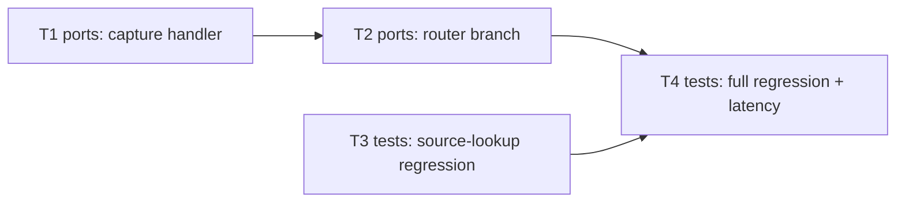

# Epic — plain-typed-message-capture

> **Spec:** [spec.md](../spec.md) · **Design:** [sad.md](../sad.md) · **Data model:** [data-model.md](../data-model.md) · **ADRs:** none spawned for this feature (sad.md §9 — both candidate decisions fell short of the blast-radius gate)

## Goal

Add a second capture entry point: the Owner can type plain text directly into the bot chat and have it captured exactly like a forwarded message — same "When to remind?" flow, same firing/snooze/resolve lifecycle, no source chat to point back to (spec §2 Goals).

## Scope

- **In:** `src/ports/conversations/capture-conversation.ts` (new sibling handler), `src/ports/router.ts` (new precedence branch), plus test coverage for the new branch and a regression lock on the existing typed-origin source-lookup fallback.
- **Out:** directly-sent media/captions, editing captured text after creation, any new UI trigger beyond typing, any change to the forwarded-message capture flow (spec §3 Non-goals).

## Task map

## Tasks

See [tracker.md](./tracker.md) for status. Machine contract: [tasks.json](../tasks.json).

| # | Task | Layer | Blocked by | DoD (short) |
|---|---|---|---|---|
| T1 | Add plain-text capture handler in capture-conversation.ts | ports | — | typed text captures + shows quick-pick (AC-01/01b), scheduling unchanged (AC-03) |
| T2 | Wire router precedence branch for plain-text dispatch | ports | T1 | command/empty exclusion + pending-prompt precedence hold (AC-02/04/04b/05/07) |
| T3 | Lock typed-origin source-lookup fallback with a regression test | tests | — | "🔗 Джерело" on a typed-origin reminder shows stored text (AC-06) |
| T4 | Run full regression suite and verify manual latency budget | tests | T1, T2, T3 | `npm test` green + ≤1000ms manual timing (QG-2/QG-3) |

## Risks / Hard rules

- **No new field or table** (spec §6.1, sad §2 Technical) — T1/T2 must not touch `migrations/` or add a column; typed-origin capture uses only the existing sentinel values.
- **Router precedence order is load-bearing** (sad §4 pillar 2) — T2's branch must sit after the pending-prompt check and before callback-query dispatch, never earlier; reordering silently breaks AC-04b/AC-07.
- **Zero regression on the forwarded path** (spec §7 KPI, sad §10 QG-3) — T4 is a hard closing gate, not optional cleanup.
