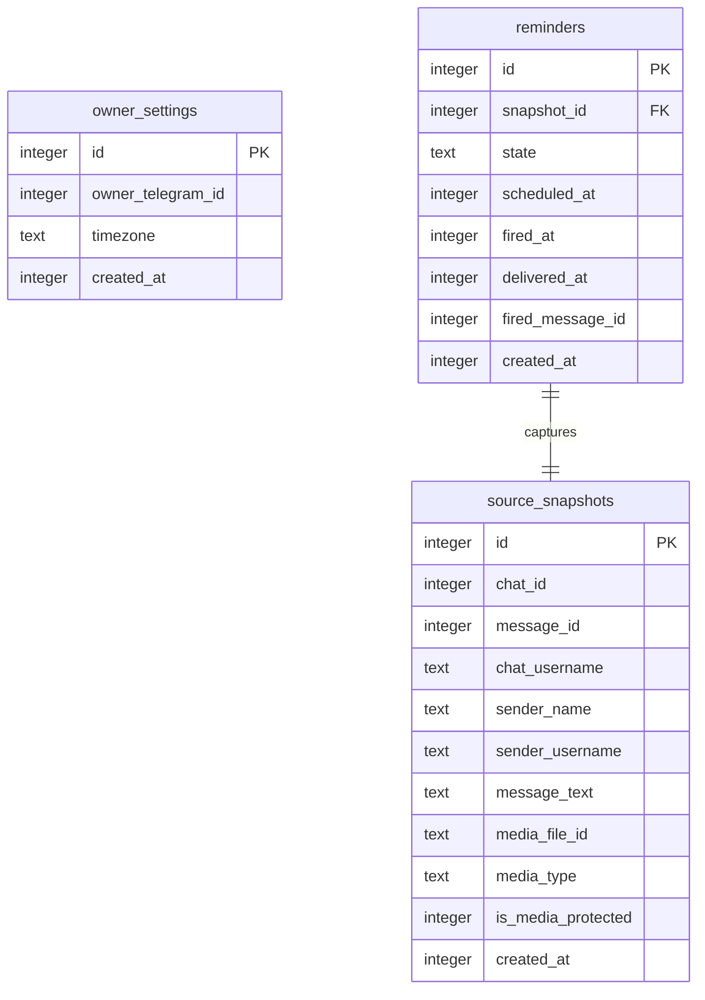

# Data Model — telegram-reminder

## ER Diagram



---

## Aggregate Roots

### Aggregate: Reminder

`reminders` is the aggregate root. `source_snapshots` is owned by the Reminder aggregate — a snapshot is created atomically with the reminder capture and has no lifecycle independent of its reminder. Both rows are written in one transaction in `CaptureMessage` (app layer).

#### Table: `reminders`

| Column | Type | Nullable | Description |
|---|---|---|---|
| `id` | `INTEGER` | NO | PK — SQLite autoincrement rowid; the `reminder_id` of §8 |
| `snapshot_id` | `INTEGER` | NO | FK → `source_snapshots.id` |
| `state` | `TEXT` | NO | Lifecycle state: `awaiting_time` \| `pending` \| `firing` \| `fired` \| `done` \| `deleted` \| `expired` (CHECK) |
| `scheduled_at` | `INTEGER` | YES | UTC Unix epoch ms when to fire; NULL while `awaiting_time` |
| `fired_at` | `INTEGER` | YES | UTC Unix epoch ms when fire was attempted (for ±60 s accuracy metric, spec §6) |
| `delivered_at` | `INTEGER` | YES | UTC Unix epoch ms when Telegram delivery was confirmed; at-least-once guard (ADR-0005) |
| `fired_message_id` | `INTEGER` | YES | Telegram `message_id` of the fired-reminder message; needed to delete/edit it on Done/Delete (AC-06/07) |
| `created_at` | `INTEGER` | NO | UTC Unix epoch ms when the reminder was captured |

State machine (§12 sad.md):
`awaiting_time → pending → firing → fired → done|deleted`
`awaiting_time → expired` (24 h, no Owner response)
`fired → pending` (Snooze)

#### Table: `source_snapshots`

| Column | Type | Nullable | Description |
|---|---|---|---|
| `id` | `INTEGER` | NO | PK — autoincrement |
| `chat_id` | `INTEGER` | NO | Telegram chat ID of the source chat |
| `message_id` | `INTEGER` | NO | Telegram `message_id` in the source chat |
| `chat_username` | `TEXT` | YES | Public username of the source chat; presence + `message_id` together enable the deep link (AC-11) |
| `sender_name` | `TEXT` | YES | Display name of the original sender (from forward header) |
| `sender_username` | `TEXT` | YES | Telegram username of the original sender |
| `message_text` | `TEXT` | YES | Captured text content; NULL for media-only messages |
| `media_file_id` | `TEXT` | YES | Telegram `file_id`; NULL if message had no media or media was protected |
| `media_type` | `TEXT` | YES | e.g. `photo`, `video`, `document`; NULL if no media |
| `is_media_protected` | `INTEGER` | NO | `1` if source chat forbids forwarding (protected-content); affects AC-12 |
| `created_at` | `INTEGER` | NO | UTC Unix epoch ms when the snapshot was taken |

---

### Standalone: OwnerSettings

Singleton (`id = 1` enforced by CHECK). Written on first `/settings` call; read on every incoming update to gate the timezone check (AC-13).

#### Table: `owner_settings`

| Column | Type | Nullable | Description |
|---|---|---|---|
| `id` | `INTEGER` | NO | PK — always `1` (singleton guard: `CHECK (id = 1)`) |
| `owner_telegram_id` | `INTEGER` | NO | Telegram user ID of the Owner; used for AuthZ on every incoming update (AC-09) |
| `timezone` | `TEXT` | YES | IANA timezone string (e.g. `Europe/Kyiv`); NULL until Owner sets it; gates capture (AC-13) |
| `created_at` | `INTEGER` | NO | UTC Unix epoch ms of first settings write |

---

## Indexes

| Index | Table | Columns | Query it serves |
|---|---|---|---|
| `PRIMARY KEY` (implicit) | `reminders` | `id` | PK lookup by `reminder_id` in every callback flow (Flows 3, 6, 7, 8) |
| `idx_reminders_state_scheduled_at` | `reminders` | `(state, scheduled_at)` | Scheduler query: `WHERE state = 'pending' AND scheduled_at <= now` (Flow 2, §6 note) |
| `idx_reminders_snapshot_id` | `reminders` | `snapshot_id` | FK index — every `REFERENCES` must have a backing index; also path for any future cascade-delete |
| `PRIMARY KEY` (implicit) | `source_snapshots` | `id` | JOIN target from `reminders` |
| `PRIMARY KEY` (implicit) | `owner_settings` | `id` | Singleton read on every update (settings gate) |

No "just in case" indexes — every index above has a concrete query.

---

## Seeds

**Bootstrap seeds:** None for v1. `owner_settings` is populated interactively via `/settings` on first use; no hardcoded rows needed.

**Lookup data seeds:** None — the bot has no lookup tables.

**Test fixtures** (NOT in `migrations/` — generated via factory functions at test time):

```typescript
// Factory signatures — implementations live in test/helpers/factories.ts
buildOwnerSettings(overrides?: Partial<OwnerSettingsRow>): OwnerSettingsRow
buildSourceSnapshot(overrides?: Partial<SourceSnapshotRow>): SourceSnapshotRow
buildReminder(state: ReminderState, overrides?: Partial<ReminderRow>): ReminderRow
```

PII guard: use `owner_telegram_id: 123456789` (numeric, not a real name); never real emails or names in fixtures.

---

## Migration staging

Files live under `docs/features/telegram-reminder/migrations/` (feature-local ordinals).
`implement` promotes them into the live `migrations/` tree (custom runner, sequential `NN_*.{up,down}.sql` naming).

| File | Purpose |
|---|---|
| `01_create_owner_settings.{up,down}.sql` | Singleton settings table |
| `02_create_source_snapshots.{up,down}.sql` | Source-message snapshot table |
| `03_create_reminders.{up,down}.sql` | Reminder table + indexes |

The custom migration runner creates a `_migrations` tracking table at boot (`IF NOT EXISTS`) before applying any file — this table is not itself a migration file.

> **FK note:** SQLite does not enforce foreign keys by default. The runner must execute `PRAGMA foreign_keys = ON` at connection open time (once per connection).
