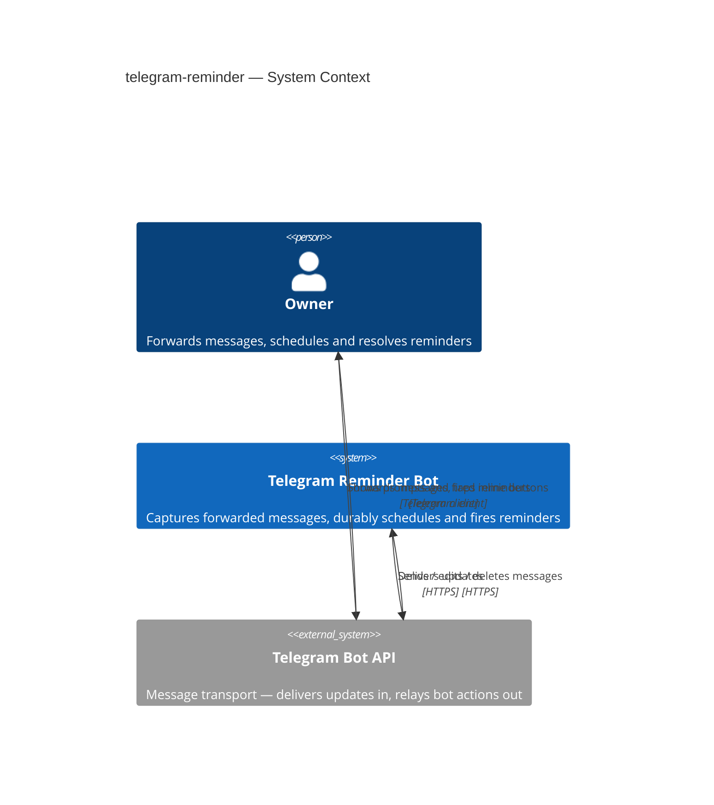
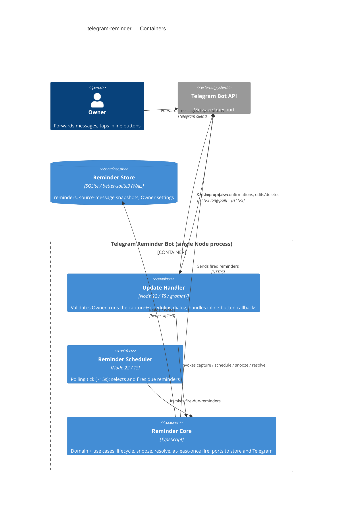
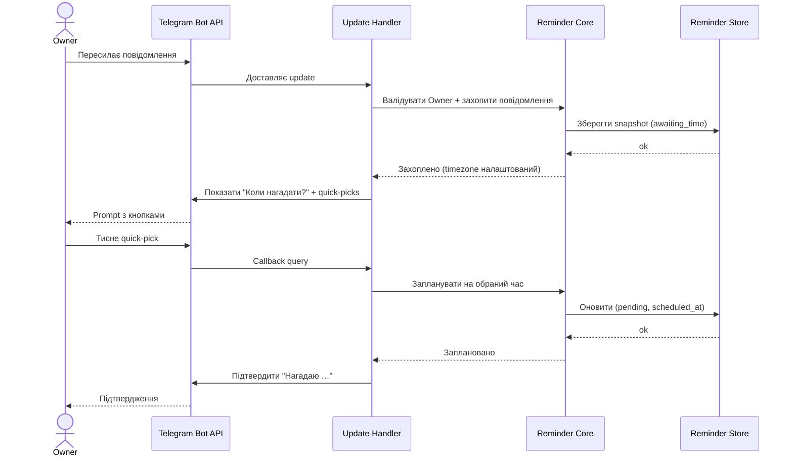
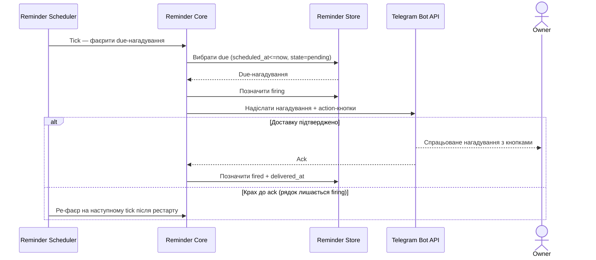

# Software Architecture Document — <slug>

<!-- 12 Arc42 sections. Empty section → <!-- N/A: <one-line reason> -->. -->
<!-- C4 Context (L1) lives inline in §3. C4 Container (L2) lives inline in §5. -->
<!-- Numbers in §10 come VERBATIM from spec.md §6 NFR — no inventing, no rounding. -->

## 1. Introduction and goals

<!-- 🎯 Why: durable memory of «what + the three dominant qualities + who cares». A year from
     now nobody recalls which three qualities were critical for this system.
     📋 Write: 1 ¶ intent + 3 lines of top-3 quality goals + a stakeholders table.
     ¶4 is the override slot — critic `Override` resolutions emit «Decision override: <headline>
     — rationale: <reason>» bullets here so downstream skills see the deliberate choice. -->

**Intent.** Персональний Telegram-бот, прив'язаний до одного акаунта (Owner). Owner пересилає боту будь-яке повідомлення з інших чатів; бот питає «коли нагадати?» (quick-pick або довільний час), durable-зберігає нагадування і повертає його у призначений час з inline-кнопками (Snooze / Done / Delete / Go to source). Owner є водночас єдиним користувачем і будівником, тому швидкість доставки та персональна зручність важливіші за багатокористувацьку розширюваність (spec §1, §2).

**Top-3 quality goals (1-liners; full scenarios in §10):**

1. **Durability / відновлюваність** — жодне pending-нагадування не втрачається через рестарт сервісу (spec §2 Goal 3 — абсолютна вимога, без числового допуску).
2. **Точність спрацювання** — нагадування фаєриться в межах ±60 с від призначеного часу (spec §6).
3. **Чутливість (latency)** — відповідь на натискання inline-кнопки p95 ≤ 2 с; захоплення пересланого повідомлення < 10 с (spec §6, §2).

(Availability ≥ 99% / місяць та anti-flood ≤ 10 повідомлень / 60 с — підтримувальні NFR, повний розбір у §10.)

**Stakeholders.**

| Role | Interest | Sign-off owner? |
|---|---|---|
| Owner | Єдиний користувач — захоплює й отримує нагадування; він же будівник системи | No |
| Tech Lead | Затвердження SAD | Yes |

<!-- Decision overrides (¶4) — populated by the critic resolution loop, empty otherwise. -->

## 2. Constraints

<!-- 🎯 Why: §4 strategy only works when §2 has fixed WHAT IS ALREADY FIXED — stack, versions,
     deadline, regulatory. This is an input, not an output.
     📋 Write: four blocks — Technical / Organisational / Conventions / Regulatory.
     📌 Pin versions («<datastore> 18», not «<datastore>»); «Q3 deadline — hard», not «ideally».
     Never N/A — every feature inherits at least Conventions + Technical. -->

**Technical.**
- Мова + runtime: **Node.js 22 + TypeScript** (ADR-0001).
- Telegram-фреймворк: **grammY** (з conversations-плагіном для діалогу «коли нагадати?») (ADR-0001).
- Datastore: **embedded SQLite** через `better-sqlite3` — engine + binding фіксуються у §4 (стовп durability, ADR-0002).
- Стиль архітектури: hexagonal / ports-and-adapters — встановлюється у §5 (greenfield, конвенції задаємо ми).

**Organisational.**
- Бюджет зусиль: персональний проєкт, фіксованого бюджету немає; Owner — єдиний будівник.
- Дедлайн: не заявлено (персональний інструмент, без жорсткої дати).
- Команда: solo (Owner у ролях Architect + Developer).

**Conventions.**
- Greenfield — окремого файлу конвенцій ще немає; базові конвенції встановлюються цим SAD (§5 layering, §8 crosscutting: logging / error-handling / ID-стратегія).
- Naming: TypeScript-ідіоматика (camelCase для коду, snake_case для колонок SQLite); деталі error-handling — §8.

**Regulatory / external.**
- Класифікація даних: **Confidential** (spec §6.1) — особистий контент пересланих повідомлень. Single-user, без multi-tenant межі; сховище — на хості, підконтрольному Owner.
- AuthZ: кожен вхідний update валідується проти Owner Telegram-ID до будь-якої обробки (spec §6.1) — крос-катінг у §8.
- Режиму комплаєнсу немає (персональний інструмент, без зовнішнього authentication-surface поза Telegram-ідентичністю). Telegram — єдина зовнішня межа довіри.

## 3. Context and scope

<!-- 🎯 Why: draws the SYSTEM BOUNDARY — who talks to it from outside, where the trust zone ends.
     Without §3, §5 and §8 (authorization) blur — unclear what's «inside» vs «outside».
     📋 Write: 2–3 sentences of business context + an external-systems table + a C4Context block.
     📌 «External: none (deliberate, no third-party in v1)» is itself a decision worth stating.
     Trust boundary — the line past which you don't trust data without checking it.
     Never N/A — greenfield still draws the planned actors + external systems. -->

Система — персональний Telegram-бот, що обслуговує єдиного користувача (Owner). Owner не звертається до бота напряму: усі взаємодії проходять через клієнт Telegram і **Telegram Bot API** — єдину зовнішню систему, з якою бот інтегрується. Bot API доставляє боту вхідні update'и (переслані повідомлення, натискання inline-кнопок) і ретранслює дії бота (надсилання / редагування / видалення повідомлень) назад у чат Owner.

<!-- brownfield: N/A — greenfield repo -->

**Межа довіри:** усе, що приходить від Telegram, вважається недовіреним, доки `user_id` відправника не звірено з налаштованим Owner-ID; non-Owner update'и відкидаються до будь-якої обробки чи запису (spec §6.1, AC-09).

**External systems (in / out):**

| Actor or system | Type | Interaction |
|---|---|---|
| Owner | Person | Пересилає повідомлення, натискає inline-кнопки, отримує спрацьовані нагадування — усе через клієнт Telegram |
| Telegram Bot API | System (external) | Доставляє боту update'и (in); приймає від бота надсилання / редагування / видалення повідомлень (out) |

**C4 Context (L1):** <!-- syntax → references/c4-mermaid-syntax.md. Real names, no <placeholder> stubs. -->



## 4. Solution strategy

<!-- 🎯 Why: the 3–4 STRATEGIC PILLARS every ADR grows from. Without §4 each ADR looks random —
     there's no umbrella. ⭐ The densest section — the blast-radius gate fires almost always here
     (decisions are irreversible + multi-module).
     📋 Write: 3–4 choices; each a heading + 2–3 sentences of rationale.
     📌 «Store content as a table of typed blocks» is a pillar — ADR-0001 grows from it. -->

**Top strategic choices (the seeds for ADRs):**

1. **Single-process bot service (target surface = `backend-service`)** — один Node-процес хостить і реактивний обробник update'ів, і проактивний scheduler як внутрішній компонент. Для single-user інструменту (spec §3) це мінімізує deploy/ops-поверхню і служить пріоритету «швидка доставка + персональний фіт» (spec §1). UI — це inline-клавіатури Telegram (зовнішня система), тож web/mobile-поверхонь немає. `target_surfaces: [backend-service]`.
2. **Long-polling intake (`getUpdates`)** (ADR-0003) — бот тягне update'и від Telegram, а не виставляє публічний webhook. Не потрібен публічний домен/TLS → бот біжить за NAT і має нульову inbound attack-surface (spec §6.1). Webhook-latency несуттєва, бо домінує точність фаєрингу, а не latency інтейку.
3. **Embedded SQLite, один файл (`better-sqlite3`)** (ADR-0002) — увесь стан нагадувань durable-зберігається в одному SQLite-файлі; durability (spec §2 Goal 3) дає WAL + синхронний fsync. Нуль зовнішньої інфраструктури — узгоджено з «мінімальний ops».
4. **Polling-tick scheduler, store — джерело істини** (ADR-0004) — нагадування живуть у SQLite, не в in-memory таймерах; періодичний tick (~15 с) фаєрить due-рядки. Після рестарту scheduler просто продовжує tick — Goal 3 стає структурною властивістю, а не процедурою відновлення. ~15 с ≪ ±60 с (spec §6).
5. **At-least-once доставка з підтвердженням** (ADR-0005) — перехід pending→fired фіксується лише після підтвердженої Telegram-доставки (поле `delivered_at`); рядок, що завис у `firing` після рестарту, ре-фаєриться. «No silent loss» (Goal 3) переважає «no duplicate» (spec §6.1).

Кожне tactical-рішення в наступних секціях трасується до одного з цих стовпів. Tactical-рішення, що *суперечать* стратегічному вибору — червоні прапорці, виносяться у §11.

## 5. Building block view

<!-- 🎯 Why: INTERNAL DECOMPOSITION — modules, containers, datastores. The static topology: who
     may talk to whom. Without §5, §6 (the flows) has no vocabulary of participants.
     📋 Write: 1 ¶ on the style (layered / hexagonal / clean / event-driven) + a folder tree + a
     C4Container block.
     📌 Draw ONE Container per declared `target_surface` (frontmatter): a fullstack
     [backend-service, web-frontend] = a backend-API container + a web/SPA container; a
     [backend-service, mobile-app] = the API + the mobile app. The Container(web, …) line below is
     just one surface's container — swap/add per what was declared in §4. → _shared/surfaces.md
     📌 e.g. «web app, content API, media worker, datastore, object store, CDN». -->

**Ports-and-adapters (hexagonal)** (ADR-0006). domain + app у центрі; дві зовнішні залежності — сховище і Telegram — за port-інтерфейсами (`ReminderRepository`, `TelegramGateway`), а їхні реалізації (better-sqlite3, grammY) живуть як адаптери в `infra`. Це робить фаєринг- і at-least-once-логіку (ADR-0004/0005, стовп durability) тестовною ізольовано — проти in-memory store + fake-gateway, без реального Telegram чи диска. Застосунок — одна фіча (reminder), один deployable Node-процес; scheduler — внутрішній компонент того ж процесу, але показаний окремим контейнером, бо його lifecycle самостійний.

**Internal decomposition:**

```
src/
├── domain/      Reminder-сутність + lifecycle state-machine
│                (awaiting_time → pending → firing → fired → done|deleted|expired),
│                value-objects (ScheduledTime, SourceMessageSnapshot), sentinel-помилки
├── app/         use-cases: CaptureMessage, ScheduleReminder, FireDueReminders,
│                SnoozeReminder, ResolveReminder (done/delete), ExpireStalePrompts
│                + порти: ReminderRepository, TelegramGateway (інтерфейси)
├── infra/       SqliteReminderRepository (better-sqlite3), GrammyTelegramGateway
├── ports/       grammY-роутер + conversations (діалог «коли нагадати?»),
│                callback-query handlers, DTO, error-mapping
├── scheduler/   polling-tick worker (in-process)
└── main.ts      composition root (wiring)
```

**C4 Container (L2):** <!-- syntax → references/c4-mermaid-syntax.md. Real names, no <placeholder> stubs. ONE Container per declared target_surface (frontmatter); single surface backend-service. -->



## 6. Runtime view

<!-- 🎯 Why: the RUNTIME FLOW of 1–2 critical scenarios — who talks to whom, when, in what order.
     Without §6, §5 is just boxes with no life.
     📋 Write: a Mermaid sequenceDiagram. Participants are names from §5 (don't invent new ones).
     Messages are semantic («saves a draft»), NO HTTP verbs / paths / status codes — endpoint-level
     sequences arrive at the `api` stage.
     📌 e.g. «author → web: composes draft → web → content API: save». Seed the primary flow(s) here;
     the `sequences` stage then covers every §5 AC (no cap). Never N/A for M+; XS/S keeps ≥1 happy-path flow. -->

**Critical flow 1: захоплення повідомлення та планування через quick-pick (happy path, AC-01..02)**



**Critical flow 2: фаєринг із at-least-once-відновленням (AC-04, spec §6.1)**



**Двофазова обробка (lifecycle):** перед `pending` нагадування проходить фазу `awaiting_time` (захоплено, час ще не обрано). Якщо Owner не відповідає на prompt — спрацьовує expiry (DEC-6.2). Custom-time-парсинг (DEC-6.3) живить крок «Запланувати на обраний час» у Flow 1.

## 7. Deployment view

<!-- 🎯 Why: the TOPOLOGY DevOps must know without reading the deploy charts — how many replicas,
     where the background worker lives, AT WHAT NUMBERS we scale.
     📋 Write: 2–3 sentences on topology + monitoring + concrete threshold numbers.
     📌 e.g. «500 authors → partition by quarter» (not «we'll think about scale later»).
     🎯 N/A allowed for XS/S that reuses an existing deployment unit with no change.
     Deployment-diagram scaffold → templates/deployment.md. -->

Один Node 22-процес (бот) на одному always-on хості (малий VPS або домашній сервер). Long-polling (ADR-0003) → **нуль inbound-портів / без публічного endpoint**. Стан — один SQLite-файл на локальному диску хоста (ADR-0002); рестарт (деплой / крах / reboot) нічого не втрачає — polling-tick scheduler відновлюється зі store (ADR-0004). **Рівно одна репліка**: SQLite single-writer, а polling-tick не повинен крутитися двічі паралельно (друга репліка → подвійний фаєринг) — обмеження виведене з ADR-0002/0004.

**Monitoring:**
- Метрики: fire-accuracy = `fired_at − scheduled_at` на нагадування; action-latency = callback→response delta; 429 / flood-wait error rate (spec §6).
- Availability ≥ 99% / міс (spec §6): через **push-heartbeat** — бот пінгує зовнішній uptime-монітор (UptimeRobot heartbeat або еквівалент) щохвилини; пропуск heartbeat → монітор сповіщає Owner. Push-heartbeat обрано, бо long-polling не лишає inbound-endpoint для класичного ping.
- Tracing: <!-- N/A: single process — структуровані логи (§8) достатні замість distributed tracing -->

**Scaling thresholds:**
- Single-user, single-replica за дизайном (non-goal: multi-user, spec §3) — без партиціонування.
- Один SQLite-файл комфортно тримає роки нагадувань одного користувача; поріг масштабування не застосовний.

## 8. Crosscutting concepts

<!-- 🎯 Why: CROSS-CUTTING PATTERNS spanning several modules: logging, errors, authorization, ID
     strategy, events, caching. ⭐ The second-densest section. A pattern inside one module is NOT
     here; a project-wide convention belongs in the convention file.
     📋 Write: a table — concept / convention / where defined. One row per concept.
     📌 e.g. «sortable time-based IDs generated in the app layer» as a default from the convention file. -->

| Concept | Convention | Where defined |
|---|---|---|
| Logging | Структуровані JSON-логи, поля `module`, `reminder_id`, `event` (captured/scheduled/fired/resolved/expired) | тут |
| Authorization | Перевірка єдиного Owner-ID в ingress-адаптері до будь-якого use-case; non-Owner update'и тихо відкидаються (AC-09) | тут / ports |
| Error handling | Domain sentinel-помилки → ports error-mapping → user-facing Telegram-повідомлення; transient Telegram/network → retry з backoff | ports (ADR-0006) |
| ID strategy | `reminder_id` = SQLite autoincrement rowid (монотонний, time-sortable), генерується в app-шарі | тут |
| Reminder lifecycle | State-machine: `awaiting_time → pending → firing → fired → done\|deleted`; `awaiting_time → expired` (24h, DEC-6.2); `fired → pending` (snooze) | §12 |
| Time / timezone | `scheduled_at` зберігається в UTC; wall-clock quick-picks і custom-time обчислюються в timezone Owner (`settings.timezone`); AC-13 гейтить захоплення, доки tz не задано | тут |
| Input handling | Custom-time parser: відносний + структурований формат (DEC-6.3); date-only→09:00, time-only→next future occurrence | тут |
| Delivery semantics | At-least-once з `delivered_at`-підтвердженням (ADR-0005); ре-фаєр `firing`-рядків після рестарту | ADR-0005 |
| Anti-flood | Поважати Telegram 429 / flood-wait; cap ≤ 10 повідомлень / 60 с (spec §6); backoff на flood-wait | тут |
| Message-deletion fallback | На resolve видалити fired-повідомлення; якщо > 48h delete-window — edit до empty/resolved placeholder (AC-06/07) | тут |
| Protected-content media | Якщо media file_id невідновлюваний — фаєр text + note, усі action-кнопки лишаються (AC-12) | тут |
| Internationalisation | <!-- N/A: одна мова (українська), один користувач --> | — |
| Observability | Метрики + структуровані логи (без distributed tracing) | §7 |

## 9. Architecture decisions

<!-- 🎯 Why: the REVERSE INDEX onto the adr/ folder. `ls adr/` gives the files; §9 gives the
     semantics — why they exist, which SAD section they attach to, what status.
     📋 Write: a 4-column table, one row per ADR. Mixed status is fine.
     📌 e.g. «0001 | Store content as a table of typed blocks | Accepted | §4». -->

| # | Title | Status | Section |
|---|---|---|---|
| 0001 | Use Node.js + TypeScript + grammY for the bot runtime | Accepted | §2 |
| 0002 | Use an embedded single-file SQLite store | Accepted | §4 |
| 0003 | Use long-polling (getUpdates) for Telegram intake | Accepted | §4 |
| 0004 | Fire reminders with a polling-tick scheduler over the store | Accepted | §4 |
| 0005 | Deliver fired reminders at-least-once with a confirmation flag | Accepted | §4 |
| 0006 | Structure the bot as ports-and-adapters (hexagonal) | Accepted | §5 |

ADR files live under `docs/features/telegram-reminder/adr/NNNN-<title>.md`.

## 10. Quality requirements

<!-- 🎯 Why: the QUALITY TREE — take a goal from §1 and break it into concrete leaves: tests,
     metrics, configs, drills. ⭐ Without §10, §1 is a manifesto. With §10 each declaration maps
     to something PROVABLE.
     📋 Write: per §1 goal — When / Then / How-verify. Numbers from spec §6 NFR VERBATIM (don't
     round ≤250ms to ≤300ms — that's a critic F6 hit).
     📌 e.g. «p95 ≤ 500 ms on a block update, verified by a 100 req/s load test». -->

Top-3 quality goals з §1 (+ 2 підтримувальні NFR) розгорнуті у повні сценарії. Числа й методи вимірювання — verbatim зі spec §6.

**QG-1. Durability / відновлюваність**
- **When:** сервіс рестартує (деплой / крах / reboot), маючи pending-нагадування.
- **Then:** zero pending reminders silently lost across service restart.
- **How verify:** integration test — schedule reminder, restart service, confirm it fires.

**QG-2. Точність спрацювання**
- **When:** pending-нагадування досягає свого scheduled-часу.
- **Then:** fires within ±60 s of scheduled time.
- **How verify:** diff between `scheduled_at` and `fired_at` logged per reminder.

**QG-3. Latency дії**
- **When:** Owner тисне inline-action-кнопку (Snooze / Done / Delete / Go to source).
- **Then:** ≤ 2 s from button tap to bot response (p95).
- **How verify:** bot-side timestamp delta logged per callback.

**QG-4. Availability (підтримувальна)**
- **When:** безперервна робота протягом календарного місяця.
- **Then:** ≥ 99% monthly uptime.
- **How verify:** external uptime monitor (UptimeRobot or equivalent) через push-heartbeat (§7).

**QG-5. Anti-flood (підтримувальна)**
- **When:** бот формує кілька вихідних повідомлень у короткому вікні.
- **Then:** no more than 10 bot messages sent within any 60-second window.
- **How verify:** 429 / flood-wait error rate in bot logs.

## 11. Risks and technical debt

<!-- 🎯 Why: ⭐ collects EVERYTHING that can break — not only the technical. Without §11 risks get
     discussed at standups and lost; debt lives only in the head of whoever accepted it.
     📋 Write: a risk/debt table — severity — mitigation — owner. Accepted debt in its own block.
     📌 The first risk is often a product risk, not a technical one. That's normal. -->

<!-- Severity literals: Low / Medium / High for regular risks; "Open question" for rows created by
     a Save-as-OQ resolution during the Socratic walk (see references/socratic.md). -->

| Risk / debt | Severity | Mitigation | Owner |
|---|---|---|---|
| Single-replica double-fire (запуск 2 екземплярів → нагадування фаєрять двічі) | Medium | Process-manager гарантує один екземпляр; задокументувати обмеження; опційний advisory file-lock на старті | Mykhailo Podaniev |
| Рідкісний дубль на межі delivery↔`delivered_at` крах | Low | Accepted per spec §6.1 (at-least-once); звузити пізніше через Telegram message-id idempotency | Mykhailo Podaniev |
| Telegram delete-window > 48h блокує видалення fired-повідомлення | Low | Edit повідомлення до empty/resolved placeholder (AC-06/07) | Mykhailo Podaniev |
| Обрив long-polling-з'єднання при transient network failure | Low | grammY auto-reconnect з backoff | Mykhailo Podaniev |
| Open architectural decision: фаєрити нагадування при невідновлюваному media (spec §8 OQ-2) | Open question | Resolve before `sdd:tasks`; default = fire text + note per AC-12 | Mykhailo Podaniev |

**Accepted debt (acceptable in v1, plan to fix later):**
- At-least-once може зрідка дублювати нагадування на crash-межі — прийнятно для v1 per spec §6.1.
- `better-sqlite3` — нативний модуль, потребує рекомпіляції на Node major-version bump (ADR-0001).
- Без HA — availability обмежена uptime одного хоста; прийнятно для персонального інструменту (non-goal: multi-user, spec §3).

## 12. Glossary

<!-- 🎯 Why: ⭐ the DOMAIN GLOSSARY that ends arguments a year later («checkpoint — weekly or
     biweekly? quarter — calendar or fiscal?»).
     📋 Write: a term / meaning table. Business + technical terms mixed.
     📌 e.g. «Lesson | a unit inside a course made of blocks (text, video)». -->

<!-- Базові доменні терміни (Owner, Source message, Quick-pick, Snooze, Fire, Protected-content, Deep link…) — у [CONTEXT](./CONTEXT.md) ## Glossary. Нижче — терміни, що виринули на етапі design. -->

| Term | Meaning |
|---|---|
| Reminder lifecycle | State-machine: `awaiting_time → pending → firing → fired → done\|deleted`; `awaiting_time → expired` (24h); `fired → pending` (snooze) |
| `awaiting_time` | Повідомлення захоплено, час ще не обрано; спливає через 24 год (DEC-6.2) |
| `pending` | Заплановано, очікує спрацювання |
| `firing` | Транзитний стан — надіслано, очікує підтвердження доставки (ADR-0005) |
| `fired` | Доставлено (`delivered_at` встановлено) |
| `done` / `deleted` | Resolved-стани; fired-повідомлення прибране з чату |
| `expired` | Prompt `awaiting_time` без відповіді 24 год; snapshot відкинуто |
| Polling tick | Періодичний прохід scheduler'а (~15 с), що вибирає й фаєрить due-нагадування (ADR-0004) |
| `delivered_at` | Час підтвердженої Telegram-доставки; guard для at-least-once (ADR-0005) |
| `scheduled_at` | Час спрацювання нагадування, зберігається в UTC (§8) |
| Cleared-inbox invariant | Чат бота без fired-reminder-повідомлень = немає незавершеної роботи (spec §1) |
| Port / Adapter | Інтерфейс зовнішньої залежності (ReminderRepository, TelegramGateway) та його реалізація в `infra` (ADR-0006) |
