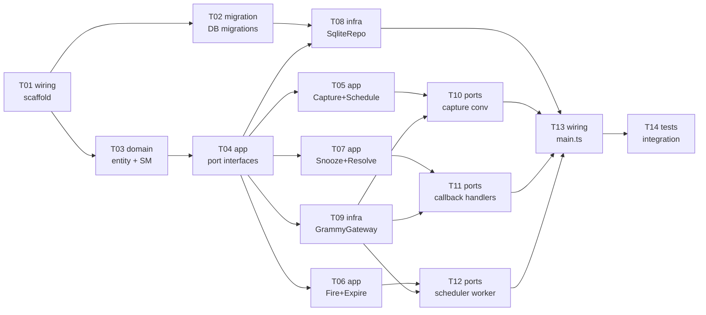

# Epic — telegram-reminder

> **Spec:** [spec.md](../spec.md) · **Design:** [sad.md](../sad.md) · **Data model:** [data-model.md](../data-model.md) · **Bot protocol:** [contracts/cli.md](../contracts/cli.md) · **ADRs:** [adr/](../adr/)

## Goal

Доставити greenfield Node.js/TypeScript-бот, який дозволяє Власнику пересилати повідомлення у Telegram і отримувати нагадування у встановлений час — із збереженням між перезапусками, at-least-once delivery, та очищенням чату при вирішенні. Реалізує всі 13 ACs зі spec §5 в архітектурі ports-and-adapters (ADR-0006) на стеці grammY + SQLite (ADR-0001, ADR-0002).

## Scope

- **In:** повний стек backend-service — scaffold, міграції, domain, app (use-cases + порти), infra-адаптери (SQLite, grammY), ports (handlers/conversations), in-process scheduler, composition root, integration tests.
- **Out:** multi-user підтримка, recurring schedules, редагування контенту, web/mobile UI (spec §3).

## Task map

## Tasks

See [tracker.md](./tracker.md) for status. Machine contract: [tasks.json](../tasks.json).

| # | Task | Layer | Blocked by | DoD (short) |
|---|---|---|---|---|
| T01 | Project scaffold (package.json, tsconfig, dirs, .env.example) | wiring | — | `tsc --noEmit` passes; `npm test` runs |
| T02 | Promote staged migrations + write migration runner | migration | T01 | 3 tables apply+revert cleanly; FK pragma on |
| T03 | Reminder entity + state machine + value objects + domain errors | domain | T01 | Unit tests for all SM transitions pass |
| T04 | Port interfaces: ReminderRepository + TelegramGateway | app | T03 | TypeScript interfaces compile; no impl yet |
| T05 | Use cases: CaptureMessage + ScheduleReminder | app | T04 | Unit tests for capture+schedule against fakes pass |
| T06 | Use cases: FireDueReminders + ExpireStalePrompts | app | T04 | Unit tests for fire at-least-once + expiry pass |
| T07 | Use cases: SnoozeReminder + ResolveReminder | app | T04 | Unit tests for snooze/resolve + resolved-guard pass |
| T08 | SqliteReminderRepository + test factories | infra | T02, T04 | Integration test: CRUD + pending-query round-trip |
| T09 | GrammyTelegramGateway | infra | T04 | Fake-gateway smoke test; compiles against grammY types |
| T10 | grammY router + capture conversation + /settings handler | ports | T05, T09 | AC-01..03, AC-08, AC-09, AC-13 handler tests pass |
| T11 | Callback handlers: Snooze, Done, Delete, Go-to-source | ports | T07, T09 | AC-05..07, AC-10..12 handler tests pass |
| T12 | In-process polling-tick scheduler worker | ports | T06, T09 | Scheduler ticks, invokes FireDueReminders; unit test |
| T13 | Composition root main.ts + startup wiring | wiring | T08, T10, T11, T12 | `npm start --dry-run` boots without error |
| T14 | Integration tests: restart durability + fire accuracy + E2E | tests | T13 | Durability + E2E capture→fire→resolve pass |

## Risks / Hard rules

- **Migration serialization:** `implement` serializes all `layer: migration` tasks — never run two migrations concurrently.
- **At-least-once invariant (ADR-0005):** `FireDueReminders` marks `firing` before sending; `delivered_at` set only after Telegram ack. T06 must implement this in full — T14 verifies it with a simulated crash.
- **AuthZ on every update (AC-09, spec §6.1):** every incoming handler in T10/T11 rejects non-Owner before any storage write — enforced in the router middleware, not per-handler.
- **Telegram 48h delete window (AC-06/07):** Done/Delete must fall back to edit-to-placeholder when `deleteMessage` returns `MESSAGE_CANT_BE_DELETED` — T11 implements both branches.
- **No FK enforcement by default in SQLite (data-model.md):** migration runner must execute `PRAGMA foreign_keys = ON` per connection — T02 implements this.
