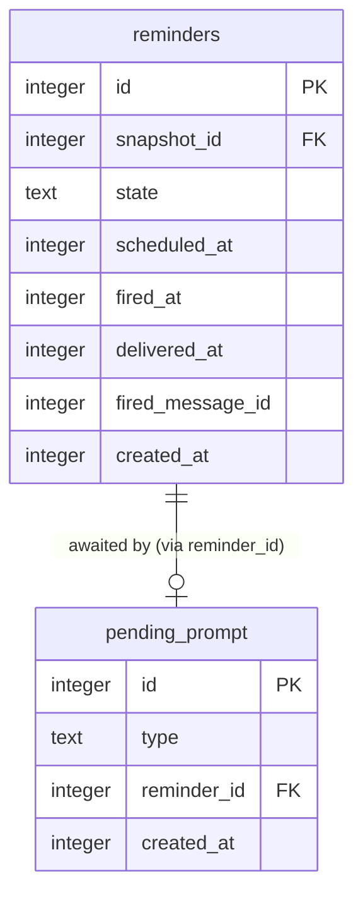

# Data model — webhook-cron-wake

> Single new entity: the durable "awaiting custom time" prompt (spec AC-05, sad.md §5 decision 2)
> replacing the in-memory `pendingCustom` map (`src/ports/router.ts:19`). No other schema change —
> reminder delivery idempotency (AC-06) is enforced by the existing `reminders` **state machine**:
> `findDuePending` selects only `state = 'pending'` and `findFiring` only `state = 'firing'`, so an
> occurrence already recorded `fired` is excluded from both and never re-sent, even on a retried
> wake call. The graceful-shutdown drain (sad.md §4 decision 5) narrows the residual race window
> between a successful send and the `markFired` write; within that window a `firing` occurrence is
> re-sent by `findFiring` (favoring redelivery), the accepted at-least-once trade-off from ADR-0005.
> `delivered_at` / `fired_message_id` are persisted for the audit trail but are **not** the skip
> guard — the state value is. No new column needed. `owner_settings`, `source_snapshots`,
> `reminders` are unchanged.

## ER diagram

## Entities

### `pending_prompt` (new)

| Column | Type | Constraints | Notes |
|---|---|---|---|
| `id` | INTEGER | PK, `CHECK (id = 1)` | singleton row — only one Owner, only one prompt can be pending at a time (sad.md §5 decision 2), mirrors `owner_settings`'s singleton pattern (`migrations/01_create_owner_settings.up.sql:5`) |
| `type` | TEXT | NOT NULL, `CHECK (type IN ('capture', 'snooze'))` | mirrors the in-memory `PendingCustom.type` union (`src/ports/router.ts:18`) |
| `reminder_id` | INTEGER | NOT NULL, FK → `reminders(id)` | the reminder awaiting a custom time; indexed below |
| `created_at` | INTEGER | NOT NULL | UTC Unix epoch ms, matching the repo's `created_at` convention on every existing table |

**Aggregate root:** root (a standalone singleton, not owned by `reminders` — it references a reminder but is not part of its aggregate; deleting/clearing it never touches the reminder row).
**Access patterns:**
- `findPendingPrompt()` → `SELECT * FROM pending_prompt WHERE id = 1` (critical flow 3, AC-05) — served by the PK, no extra index needed.
- `savePendingPrompt()` → upsert on `id = 1` (`INSERT ... ON CONFLICT (id) DO UPDATE`), replacing the map's `.set()` (`src/ports/router.ts:112`) — an intervening forward cancels the previous pending prompt in favor of the new one, per spec §8 default.
- `clearPendingPrompt()` → `DELETE FROM pending_prompt WHERE id = 1`, replacing the map's `.delete()` (`src/ports/router.ts:170`) — absence of a row means "no prompt pending," not a soft-deleted row (matches the repo: no soft-delete column exists on any table; `reminders` uses a `deleted` state value instead, which doesn't apply here since this table has no lifecycle states).
**Constraints:** `CHECK (id = 1)` (singleton, matches `owner_settings`); `CHECK (type IN (...))` (matches the `state` enum pattern on `reminders`); FK → `reminders(id)`, backed by `idx_pending_prompt_reminder_id`.

<!-- No updated_at column: the repo has no updated_at anywhere (owner_settings, source_snapshots,
reminders all use only created_at); a singleton row is fully replaced on write (upsert), not
incrementally mutated, so there is nothing an updated_at would usefully distinguish. -->

## Indexes

| Index | Columns | Query it serves |
|---|---|---|
| `idx_pending_prompt_reminder_id` | `pending_prompt(reminder_id)` | FK-index hygiene rule (every `REFERENCES` column gets a backing index, per `migrations/03_create_reminders.up.sql`'s own `idx_reminders_snapshot_id` precedent) — no direct query looks up by `reminder_id` today, but the convention is applied uniformly |

## Test fixtures

- `aPendingPrompt(overrides?)` — builds a `{ type, reminderId, createdAt }` fixture for `pending_prompt` row tests, co-located per the repo's Vitest convention (`src/infra/db/__tests__/`), modelled on the existing reminder/snapshot test builders. No PII: fixtures use only numeric ids and the `capture`/`snooze` literals — no name/email/phone fields exist on this table.
