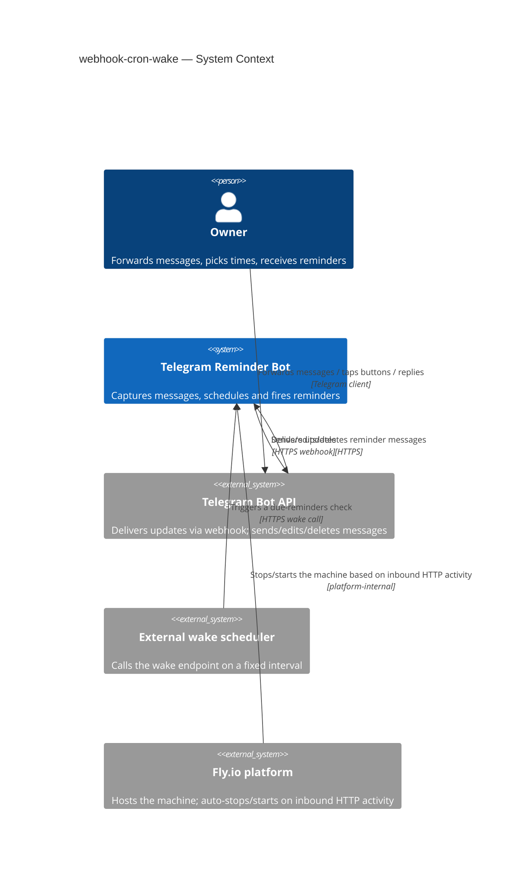
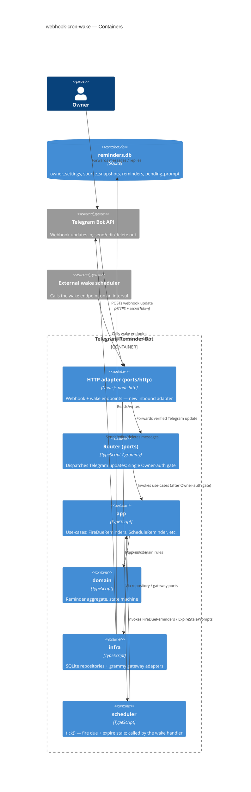
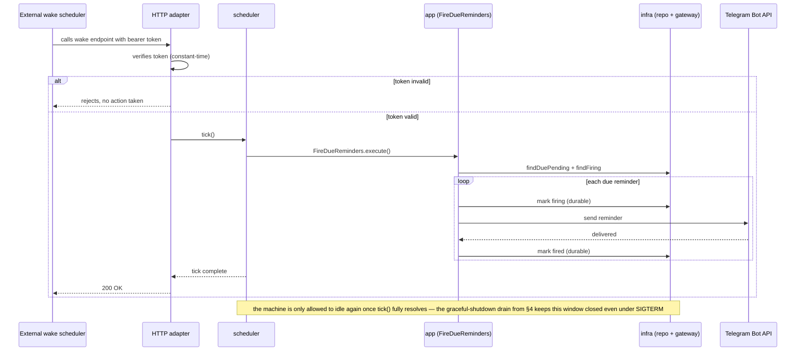
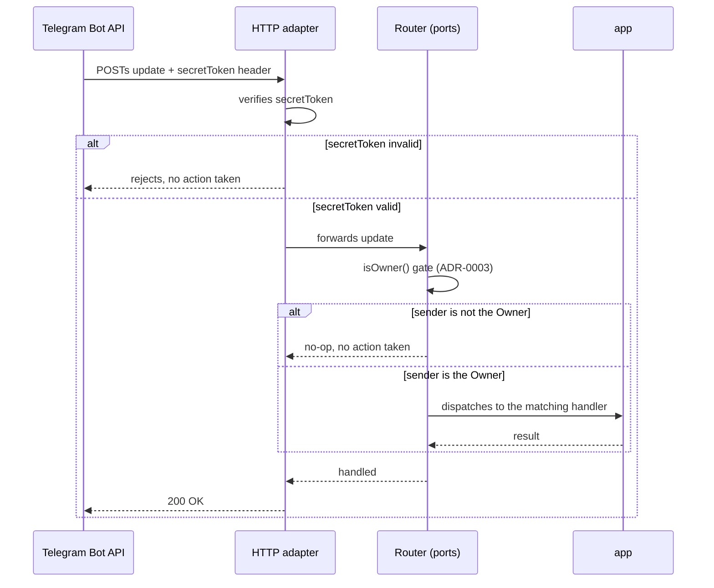

# Software Architecture Document — webhook-cron-wake

## 1. Introduction and goals

**Intent.** The bot (a single-Owner personal Telegram reminder tool) currently runs as an always-on Fly.io machine that long-polls the Telegram API continuously and separately runs an in-process 15-second timer to check for due reminders. This feature migrates the bot to a Telegram webhook plus an authenticated periodic "wake" endpoint that an external scheduler calls to trigger a due-reminders check — letting the platform safely stop and restart the machine between calls. It also closes pre-existing reliability gaps made worse by sleep/wake cycles: non-idempotent reminder delivery, non-durable "awaiting custom time" prompt state, inconsistent Owner-authorization (only `callback_query` handlers check the sender today), and a `SIGTERM` handler that doesn't await an in-flight scheduler tick before closing the DB.

**Top-3 quality goals (1-liners; full scenarios in §10):**

1. **Reliability of delivery** — reminders are never lost and never duplicated, delivered within an agreed delay bound even across machine sleep/wake cycles.
2. **Security of the new public perimeter** — the bot's first public inbound HTTP endpoints (webhook + wake) reject 100% of requests without a verifiable origin.
3. **Availability under intermittent host state** — the machine can fully stop, yet still meets the delivery-delay p95 bound and gracefully catches up on any missed wake cycle.

**Stakeholders.**

| Role | Interest | Sign-off owner? |
|---|---|---|
| Owner (CONTEXT.md) | sole user; wants reliable reminders regardless of machine state | No |
| Tech Lead (Mykhailo Podaniev) | SAD approval | Yes |

<!-- Decision overrides (¶4) — populated by the critic resolution loop, empty otherwise. -->

## 2. Constraints

**Technical.**
- TypeScript 5.4 (ES2022, NodeNext), Node.js `>=22` (`package.json:6`, `tsconfig.json`)
- `grammy` 1.21 + `@grammyjs/conversations` 1.2 (Telegram bot framework — supports both long-polling and webhook modes natively), `better-sqlite3` 9.4 (synchronous SQLite) (`package.json:18-22`)
- Hexagonal / ports-and-adapters layering: `domain` → `app` (use-cases + port interfaces) → `infra`/`ports` (adapters), manual constructor DI in the composition root (`src/main.ts:27-53`)
- No HTTP server or web framework exists in the codebase today (confirmed via dependency scan) — the webhook + wake endpoints are an entirely new inbound surface, not an extension of an existing listener

**Organisational.**
- Solo owner-developer (Mykhailo Podaniev), no team
- No hard deadline stated in spec.md; `feature_size: M` (1–2 sprints per the size matrix)
- Effort budget not explicitly quoted in the spec — flagged in §11 as an accepted gap

**Conventions.**
- Flyway-style migrations `NN_description.{up,down}.sql` in `migrations/`, tracked in `_migrations`, applied in sorted order (`src/infra/db/migrate.ts:24-42`); next number is `04`
- Manual constructor DI in the composition root (`src/main.ts:27-53`)
- Domain custom error classes extending `Error` with overridden `.name` (`src/domain/errors.ts:1-35`)
- Vitest tests, co-located `__tests__/*.test.ts`; integration tier uses a tmpdir SQLite DB
- No lint/static-analysis configured — a pre-existing gap, not introduced by this feature

**Regulatory / external.**
- Data classification: internal — personal reminder content for a single Owner; no new data classes introduced (spec §6.1)
- Security review required — this feature adds the bot's first public inbound endpoints and closes a pre-existing owner-authorization gap (spec §6.1)

## 3. Context and scope

The bot serves a single Owner on Telegram: the Owner forwards a message, picks a time, and the bot fires a reminder back into the chat at that time. Today the bot only makes outbound calls to Telegram (long-polling) — nothing external can reach in. This feature opens two new inbound trust boundaries: a Telegram webhook (replacing polling) and a periodic wake endpoint called by an external scheduler, so the hosting platform can idle-stop the machine between activity and still deliver time-based reminders.

<!-- brownfield: TypeScript/grammy/better-sqlite3 bot; hexagonal layering (domain/app/infra/ports/scheduler); no existing HTTP listener; fresh scan via sdd:explorer on commit 804889a (docs/architecture-map.md predates this by 15 commits). -->

**External systems (in / out):**

| Actor or system | Type | Interaction |
|---|---|---|
| Owner | Person | Forwards messages, picks times, replies to prompts, receives reminders — via Telegram |
| Telegram Bot API | System (external) | Delivers updates via webhook POST; receives outbound send/edit/delete calls from the bot |
| External wake scheduler | System (external) | Calls the periodic wake endpoint on a fixed interval to trigger a due-reminders check |
| Fly.io platform | System (external) | Hosts the machine; auto-stops it when inbound HTTP activity is idle, auto-starts it on the next inbound request |

**C4 Context (L1):**



## 4. Solution strategy

**Top strategic choices (the seeds for ADRs):**

1. **Target surface: `backend-service`** — the bot has no UI surface beyond the Telegram client (mediated entirely through the existing grammy integration, not a surface this feature builds); webhook + wake are new HTTP endpoints of the same single deployable process. `target_surfaces: [backend-service]` is written to this document's frontmatter.
2. **Wake call as the sole trigger for due-reminder checks** (→ ADR-0001) — the internal 15-second `setInterval` is removed; `FireDueReminders`/`ExpireStalePrompts` run only when the external wake HTTP endpoint is called. This is the only way the machine can actually reach a fully-stopped state, which is this feature's core premise; AC-07's no-cutoff catch-up semantics already cover the reliability gap a fallback timer would otherwise fill.
3. **`node:http` for the webhook and wake endpoints** (→ ADR-0002) — no HTTP framework exists in the codebase today, and the project's standing instruction is to never add a dependency without an explicit request. Two routes don't need routing/middleware machinery to stay readable.
4. **Owner-authorization centralized in a single router-dispatch gate** (→ ADR-0003) — one `isOwner()` check in `buildRouter`, before any handler runs, replacing the inconsistent pattern where only `callback_query` is checked today (`src/ports/router.ts:62-66`) while the custom-time text-input path (`src/ports/router.ts:56-59`) is not. This closes AC-04b at its root and Owner-gates any handler added later by construction.
5. **Graceful shutdown drains the in-flight tick** — `Scheduler.stop()` becomes `async` and awaits any in-flight tick before returning; `src/main.ts`'s `SIGTERM`/`SIGINT` handler (`src/main.ts:81-91`) awaits `scheduler.stop()` before calling `db.close()`. This closes AC-01b and is the primary defense for AC-06's idempotent-delivery requirement — it removes the race window between a successful Telegram send and the durable "fired" write. Scored against the blast-radius gate: touches 2 modules (`main.ts` + `scheduler.ts`) but is cheap to reverse and has no serious alternative given AC-01b's explicit wording — kept inline, no ADR.
6. **Wake-endpoint authentication: a static bearer token in an environment variable, checked in constant time** — the external scheduler is entirely under the Owner's control, so a shared secret is sufficient; rotation is a manual env-var change. The Telegram webhook is authenticated separately via grammy's built-in `secretToken` mechanism (the `X-Telegram-Bot-Api-Secret-Token` header) — an industry-standard convention with no serious alternative, so it is not treated as a separate decision. Scored against the gate: single module, low irreversibility (rotating the scheme is a config change) — kept inline, no ADR.

Each tactical decision in later sections should trace to one of these seeds.

<!-- No live AskUserQuestion response was available for DEC-4b/4c/4d/4e during this Socratic pass (60s timeout); the Recommended option was applied per Auto Mode and is flagged here for the Owner's review before this SAD is treated as final. -->

## 5. Building block view

The bot keeps its existing hexagonal layering (`domain` → `app` → `infra`/`ports`, manual constructor DI in `src/main.ts`). This feature extends it, it does not restructure it.

**Internal decomposition:**

```
src/
├── domain/                  <Reminder aggregate, state machine — unchanged>
├── app/
│   ├── use-cases/            <FireDueReminders, ExpireStalePrompts — now called by the wake handler, not a timer>
│   └── ports/                 <+ PendingPromptRepository interface (new)>
├── infra/
│   ├── db/                    <+ migration 04_create_pending_prompt, + row-mapper (new)>
│   └── telegram/               <GrammyTelegramGateway — unchanged>
├── ports/
│   ├── router.ts               <+ single isOwner() gate at dispatch (ADR-0003)>
│   ├── middleware/auth-middleware.ts  <isOwner() — reused, call site moves>
│   └── http/                   <NEW — webhook + wake adapter-in module (ADR-0002)>
│       ├── server.ts            <node:http listener, route dispatch>
│       ├── webhook-handler.ts    <verifies grammy secretToken, forwards update to the bot>
│       └── wake-handler.ts       <verifies bearer token, calls scheduler.tick()>
└── scheduler/
    └── scheduler.ts             <setInterval removed (ADR-0001); tick() becomes a public awaitable method; stop() awaits any in-flight tick>
```

**Decisions:**

1. **New module placement: `src/ports/http/`** — the webhook and wake handlers are inbound adapters (adapter-in), the same role `src/ports/router.ts` plays for Telegram updates; placing them alongside it (rather than in `infra/`) keeps the "who initiates" direction consistent with the existing convention. Modeled on `router.ts`'s wiring in `src/main.ts:53`.
2. **Durable pending-prompt persistence shape: a single-row table** (`pending_prompt`, `id=1`), mirroring the existing `owner_settings` convention (`migrations/01_create_owner_settings.up.sql`) — since there is exactly one Owner, at most one prompt can be pending at a time, so a keyed-by-sender table would carry unused generality. New migration `04_create_pending_prompt.{up,down}.sql`; repository gets `savePendingPrompt()` / `findPendingPrompt()` / `clearPendingPrompt()` on a new `PendingPromptRepository` port, implemented in `infra/db` alongside `SqliteReminderRepository`.
3. **`Scheduler.tick()` becomes the single reusable entry point** — both the (now-removed) interval and the new wake handler would have called the same method; keeping it as one public `async tick()` avoids duplicating the fire/expire sequencing logic ADR-0001 already established.

<!-- Assumed (no live response, Recommended default applied): all three §5 decisions above. Flag for review. -->

**C4 Container (L2):**



## 6. Runtime view

**Critical flow 1: Wake-triggered reminder delivery (AC-01, AC-01b, AC-06)**



**Critical flow 2: Telegram webhook message with the Owner-auth gate (AC-02, AC-04, AC-04b)**



<!-- Assumed (no live response, Recommended default applied): these two flows as the seed set for M-size design; `sequences` covers every remaining §5 AC branch (AC-03, AC-05, AC-07) in its own pass. -->

## 7. Deployment view

Single Fly.io machine, single instance — unchanged from today (no load balancer, no replicas; this is a personal, single-Owner bot). What changes is *how* the machine is kept alive: today it's always-on; after this feature it can be stopped by the platform whenever no inbound HTTP activity occurs (webhook or wake calls), and restarted automatically on the next inbound request.

**Wake interval: 3 minutes** — chosen with headroom under the spec §6 constraint (wake interval + cold-start p95 ≤ 5 min delivery-delay target). At 3 min + a 15 s cold-start p95, the worst case is ~3 min 15 s, comfortably under the 5 min bound even allowing for processing time.

**Idle window (Fly.io's own auto-stop threshold): left as an open question** — spec §8 flags this as needing empirical validation against Fly.io's actual platform behavior (does the webhook's own inbound traffic reset the idle timer before it can fire?), which cannot be determined from a design conversation; it needs to be observed after deploying. See §11 for the tracked open question.

**Monitoring:**
- Metrics: rejected-request counter (unauthenticated webhook/wake calls) — spec §6 NFR target 100% rejected
- Metrics: delivery-delay (scheduled time vs. actual sent timestamp) — spec §6 NFR target p95 ≤5 min
- Metrics: cold-start latency (wake call received vs. first successful reminder check) — spec §6 NFR target p95 ≤15s
- Alerts: none automated in v1 (single-Owner bot, manually observed) — an accepted gap, see §11

**Scaling thresholds:**
- N/A — single-Owner bot, no scaling axis; a second Owner would require a schema change (out of scope per spec §3 Non-goals)

<!-- Assumed (no live response, Recommended default applied): wake interval = 3 minutes. Flag for review — this is a concrete operational number the Owner should confirm before `tasks`. -->

## 8. Crosscutting concepts

| Concept | Convention | Where defined |
|---|---|---|
| Logging | Existing structured logging (see the `list-active-reminders` precedent); extended with rejected-request, delivery-delay, and cold-start-latency log fields for the §6 NFR measurements | here (new fields), repo convention (format) |
| Authentication | Two schemes: Telegram webhook via grammy's `secretToken` (`X-Telegram-Bot-Api-Secret-Token` header, industry standard); wake endpoint via a static bearer token (ADR seed in §4, kept inline) | §4 |
| Authorization | Single centralized Owner-check at router dispatch (ADR-0003) | §4, ADR-0003 |
| Idempotency | Reminder delivery idempotency is a domain-state-machine invariant: a reminder already recorded `fired` is never re-sent, even on a retried wake call (AC-06); enforced by the graceful-shutdown drain (§4) closing the race window between send and the durable write | §4, §6 flow 1 |
| Error handling | Existing domain sentinel-error-class pattern (`src/domain/errors.ts`) unchanged; new HTTP adapter maps an auth failure to a rejected response with no side effect (no reminder/setting touched), per AC-04 | §4 |
| ID strategy | Unchanged — SQLite `INTEGER PRIMARY KEY AUTOINCREMENT` | repo convention |
| Internationalisation | N/A — single language (Ukrainian), unchanged | — |
| Observability | New: rejected-request counter, delivery-delay timestamps, cold-start latency — feed the §10 quality scenarios directly | §10 |
| Events | N/A — no event bus introduced; the wake call is a direct HTTP-triggered method call, not an async event | — |

<!-- Assumed (no live response, Recommended default applied): repo logging/error/ID conventions kept as-is, extended only where the NFRs require new measurements. -->

## 9. Architecture decisions

| # | Title | Status | Section |
|---|---|---|---|
| 0001 | Use the external wake call as the sole trigger for due-reminder checks | Accepted | §4 |
| 0002 | Use Node's built-in http module for the webhook and wake endpoints | Accepted | §4 |
| 0003 | Centralize Owner authorization in a single router-level gate | Accepted | §4 |

ADR files live under `docs/features/webhook-cron-wake/adr/NNNN-<title>.md`.

## 10. Quality requirements

**QG-1. Reliability of delivery (idempotent, no loss)**
- **When:** the wake mechanism re-evaluates due reminders, including a retry of an earlier check.
- **Then:** duplicate reminder deliveries = 0 per reminder occurrence (spec §6 NFR, verbatim); a reminder that becomes due during a gap in wake calls still fires once the next call succeeds, never silently lost (AC-07).
- **How verify:** count of sent-events per reminder id in application logs (spec §6 NFR measurement, verbatim).

**QG-2. Security of the new public perimeter**
- **When:** a request reaches the webhook or wake endpoint without a verifiable origin (not Telegram, not the configured external scheduler).
- **Then:** unauthenticated request rejection = 100% rejected, 0% processed (spec §6 NFR, verbatim).
- **How verify:** rejected-request counter in application logs (spec §6 NFR measurement, verbatim).

**QG-3. Availability under intermittent host state**
- **When:** a reminder is scheduled at least one wake interval ahead, and the machine has been idle-stopped.
- **Then:** reminder delivery delay (p95) ≤5 min from the scheduled time (spec §6 NFR, verbatim); cold-start wake latency (p95) ≤15s from the external wake call to the process being ready to check reminders (spec §6 NFR, verbatim).
- **How verify:** compare scheduled time vs. actual sent timestamp in application logs; machine-start timestamp vs. first successful reminder check, from logs (spec §6 NFR measurements, verbatim).

## 11. Risks and technical debt

| Risk / debt | Severity | Mitigation | Owner |
|---|---|---|---|
| Open architectural decision: idle-window value needed to reach the ≥50%-stopped KPI (spec §7) is unconfirmed against Fly.io's actual platform behavior — cannot be settled in a design conversation, only by observing a real deployment | Open question | Resolve before `sdd:ship`; deploy and observe whether the webhook's own inbound traffic resets the idle timer before it can fire | Mykhailo Podaniev |
| This entire §1–§10 pass had ~10 decisions auto-resolved to their Recommended option because no live `AskUserQuestion` response arrived (60s timeout) — every `<!-- Assumed -->` comment across this document and the 3 spawned ADRs needs a real read | Medium | Owner reviews every `<!-- Assumed -->` marker in `sad.md` + `adr/0001`–`0003` before this design is treated as final | Mykhailo Podaniev |
| The router-level auth-gate refactor (ADR-0003) + the new pending-prompt persistence touch `src/ports/router.ts`, which the just-landed `list-active-reminders` feature also modified — risk of a regression in either feature if the refactor isn't test-covered first | Medium | TDD: router-level integration tests capturing today's behavior before the refactor, then the new gate, per `implement`'s per-task gate | Mykhailo Podaniev |
| No lint/static-analysis configured in the repo (pre-existing brownfield gap, not introduced by this feature) — the new HTTP adapter code ships without that safety net | Low | Rely on TypeScript strict mode + test coverage for the new module; `gate_lint` skips gracefully per `.claude/sdd.local.md` | Mykhailo Podaniev |
| No organisational effort budget was quoted in spec.md (§2 Constraints) | Low | Informal solo project — no formal budget needed unless scope grows | Mykhailo Podaniev |

**Accepted debt (acceptable in v1, plan to fix later):**
- No lint/vet gate in the repo — pre-existing, unrelated to this feature, already accepted per `docs/architecture-map.md` "Constraints & known tech-debt".

## 12. Glossary
