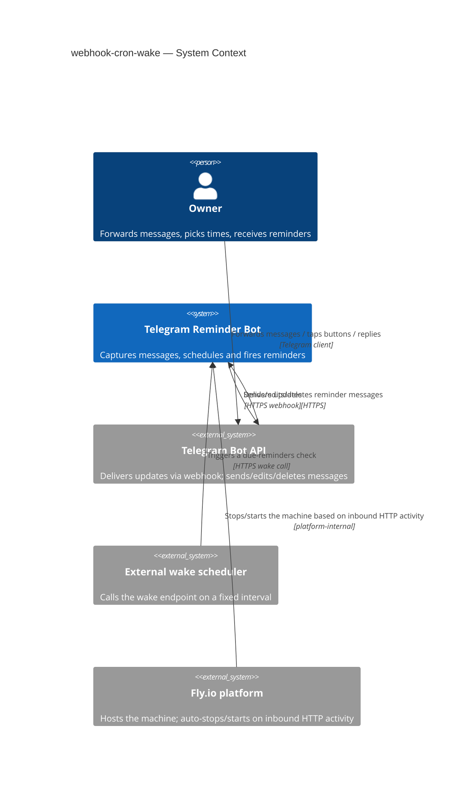

# Software Architecture Document — webhook-cron-wake

## 1. Introduction and goals

**Intent.** The bot (a single-Owner personal Telegram reminder tool) currently runs as an always-on Fly.io machine that long-polls the Telegram API continuously and separately runs an in-process 15-second timer to check for due reminders. This feature migrates the bot to a Telegram webhook plus an authenticated periodic "wake" endpoint that an external scheduler calls to trigger a due-reminders check — letting the platform safely stop and restart the machine between calls. It also closes pre-existing reliability gaps made worse by sleep/wake cycles: non-idempotent reminder delivery, non-durable "awaiting custom time" prompt state, inconsistent Owner-authorization (only `callback_query` handlers check the sender today), and a `SIGTERM` handler that doesn't await an in-flight scheduler tick before closing the DB.

**Top-3 quality goals (1-liners; full scenarios in §10):**

1. **Reliability of delivery** — reminders are never lost and never duplicated, delivered within an agreed delay bound even across machine sleep/wake cycles.
2. **Security of the new public perimeter** — the bot's first public inbound HTTP endpoints (webhook + wake) reject 100% of requests without a verifiable origin.
3. **Availability under intermittent host state** — the machine can fully stop, yet still meets the delivery-delay p95 bound and gracefully catches up on any missed wake cycle.

**Stakeholders.**

| Role | Interest | Sign-off owner? |
|---|---|---|
| Owner (CONTEXT.md) | sole user; wants reliable reminders regardless of machine state | No |
| Tech Lead (Mykhailo Podaniev) | SAD approval | Yes |

<!-- Decision overrides (¶4) — populated by the critic resolution loop, empty otherwise. -->

## 2. Constraints

**Technical.**
- TypeScript 5.4 (ES2022, NodeNext), Node.js `>=22` (`package.json:6`, `tsconfig.json`)
- `grammy` 1.21 + `@grammyjs/conversations` 1.2 (Telegram bot framework — supports both long-polling and webhook modes natively), `better-sqlite3` 9.4 (synchronous SQLite) (`package.json:18-22`)
- Hexagonal / ports-and-adapters layering: `domain` → `app` (use-cases + port interfaces) → `infra`/`ports` (adapters), manual constructor DI in the composition root (`src/main.ts:27-53`)
- No HTTP server or web framework exists in the codebase today (confirmed via dependency scan) — the webhook + wake endpoints are an entirely new inbound surface, not an extension of an existing listener

**Organisational.**
- Solo owner-developer (Mykhailo Podaniev), no team
- No hard deadline stated in spec.md; `feature_size: M` (1–2 sprints per the size matrix)
- Effort budget not explicitly quoted in the spec — flagged in §11 as an accepted gap

**Conventions.**
- Flyway-style migrations `NN_description.{up,down}.sql` in `migrations/`, tracked in `_migrations`, applied in sorted order (`src/infra/db/migrate.ts:24-42`); next number is `04`
- Manual constructor DI in the composition root (`src/main.ts:27-53`)
- Domain custom error classes extending `Error` with overridden `.name` (`src/domain/errors.ts:1-35`)
- Vitest tests, co-located `__tests__/*.test.ts`; integration tier uses a tmpdir SQLite DB
- No lint/static-analysis configured — a pre-existing gap, not introduced by this feature

**Regulatory / external.**
- Data classification: internal — personal reminder content for a single Owner; no new data classes introduced (spec §6.1)
- Security review required — this feature adds the bot's first public inbound endpoints and closes a pre-existing owner-authorization gap (spec §6.1)

## 3. Context and scope

The bot serves a single Owner on Telegram: the Owner forwards a message, picks a time, and the bot fires a reminder back into the chat at that time. Today the bot only makes outbound calls to Telegram (long-polling) — nothing external can reach in. This feature opens two new inbound trust boundaries: a Telegram webhook (replacing polling) and a periodic wake endpoint called by an external scheduler, so the hosting platform can idle-stop the machine between activity and still deliver time-based reminders.

<!-- brownfield: TypeScript/grammy/better-sqlite3 bot; hexagonal layering (domain/app/infra/ports/scheduler); no existing HTTP listener; fresh scan via sdd:explorer on commit 804889a (docs/architecture-map.md predates this by 15 commits). -->

**External systems (in / out):**

| Actor or system | Type | Interaction |
|---|---|---|
| Owner | Person | Forwards messages, picks times, replies to prompts, receives reminders — via Telegram |
| Telegram Bot API | System (external) | Delivers updates via webhook POST; receives outbound send/edit/delete calls from the bot |
| External wake scheduler | System (external) | Calls the periodic wake endpoint on a fixed interval to trigger a due-reminders check |
| Fly.io platform | System (external) | Hosts the machine; auto-stops it when inbound HTTP activity is idle, auto-starts it on the next inbound request |

**C4 Context (L1):**

## 4. Solution strategy

## 5. Building block view

## 6. Runtime view

## 7. Deployment view

## 8. Crosscutting concepts

## 9. Architecture decisions

## 10. Quality requirements

## 11. Risks and technical debt

## 12. Glossary
