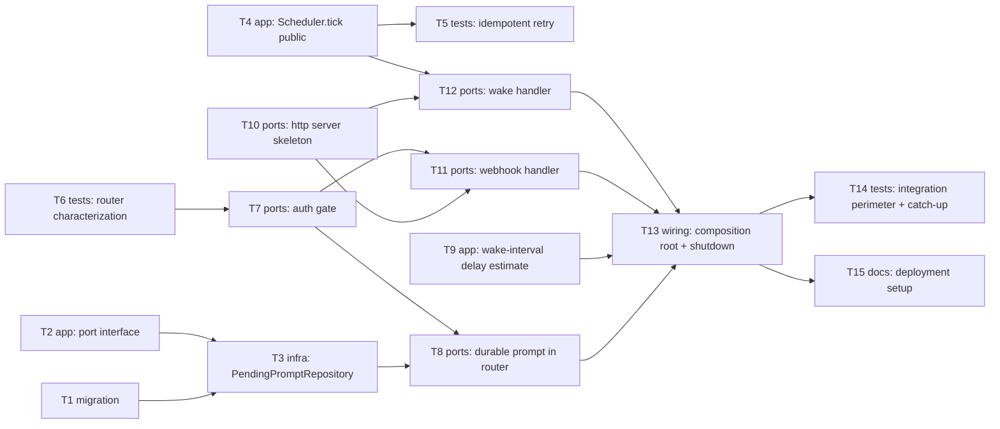

# Epic — webhook-cron-wake

> **Spec:** [spec.md](../spec.md) · **Design:** [sad.md](../sad.md) · **Data model:** [data-model.md](../data-model.md) · **API:** [openapi.yaml](../contracts/openapi.yaml) · **ADRs:** [adr/](../adr/)

## Goal

Migrate the bot from always-on long-polling + an in-process 15s timer to a Telegram webhook plus an authenticated periodic "wake" endpoint, so the Fly.io machine can fully stop between activity windows (spec §2 Goals) — while closing the pre-existing reliability gaps (non-idempotent delivery, non-durable custom-time prompt, inconsistent Owner-authorization, an ungraceful `SIGTERM`) that sleep/wake cycles would otherwise make routine.

## Scope

- **In:** a new `src/ports/http/` inbound adapter (webhook + wake endpoints, ADR-0002), a centralized Owner-auth gate at router dispatch (ADR-0003), the `pending_prompt` migration + repository, scheduler changes to make `tick()` the sole trigger (ADR-0001) with a graceful-shutdown drain, the wake-interval delay estimate (AC-03), and the composition-root + Fly.io deployment wiring.
- **Out (spec §3 Non-goals):** sub-minute delivery precision, a dedicated cron-orchestration service, cost reduction as a goal, any change to the persistence engine or the reminder domain model beyond the one new `pending_prompt` table.

## Task map

## Tasks

See [tracker.md](./tracker.md) for status. Machine contract: [tasks.json](../tasks.json).

| # | Task | Layer | Blocked by | DoD (short) |
|---|---|---|---|---|
| T1 | Promote and validate the staged `pending_prompt` migration | migration | — | applies + reverts cleanly |
| T2 | Add the `PendingPromptRepository` port interface | app | — | compiles, exported |
| T3 | Implement `PendingPromptRepository` against SQLite | infra | T1, T2 | save/find/clear tests pass |
| T4 | Make `Scheduler.tick()` public + awaitable; `stop()` drains | app | — | drain test passes |
| T5 | Idempotent-retry tests for `FireDueReminders` | tests | T4 | double-tick sends once |
| T6 | Characterize today's router dispatch/auth behavior | tests | — | pins current gap |
| T7 | Centralize Owner-auth gate at router dispatch | ports | T6 | every handler gated |
| T8 | Durable pending-prompt in router (replace in-memory map) | ports | T3, T7 | survives simulated restart |
| T9 | Wake-interval delay estimate on confirmation | app | — | delay note shown when due |
| T10 | `node:http` server skeleton + route dispatch | ports | — | 404 on unknown route |
| T11 | Webhook handler (secretToken verification) | ports | T7, T10 | 401 invalid, 200 always after verify |
| T12 | Wake handler (constant-time bearer verification) | ports | T4, T10 | 401 invalid, tick awaited before 200 |
| T13 | Wire composition root + webhook mode + graceful shutdown | wiring | T8, T9, T11, T12 | SIGTERM awaits drain |
| T14 | Integration tests: perimeter + catch-up | tests | T13 | AC-04/05/07 covered end-to-end |
| T15 | Document the deployment setup | docs | T13 | redeploy is reproducible |

## Risks / Hard rules

- **sad.md §11:** the router-auth refactor (T7) and durable-prompt wiring (T8) both touch `src/ports/router.ts`, which the just-landed `list-active-reminders` feature also modified — T6's characterization tests must exist and pass **before** T7 starts, per the repo's TDD convention.
- **ADR-0001:** the internal `setInterval` must be fully removed, not left as a fallback — `tick()` is only ever invoked by the wake handler (T12) after T13 wires it.
- **ADR-0002:** no HTTP framework dependency may be added — T10/T11/T12 use only `node:http`, per the project's standing "no package without explicit request" instruction.
- **spec §6 constraint:** the wake interval (3 min, sad.md §7) must stay below the 5 min delivery-delay NFR with headroom — T9 and T15 must reference the same configured value, not hardcode a second one.
